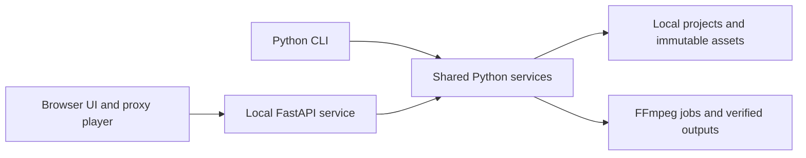

# Implementation and supplied asset review — 3 October 2026

## Decision

Build a **local web app** with a small TypeScript/Vite interface, Python/FastAPI service and FFmpeg renderer. This uses the user's permission to replace the macOS client and removes Kotlin/JVM, embedded-player integration and native DMG work from V1. The existing Python service boundary makes this a contained change. It does not reduce the work required for correct rendering, usable assets or creative approval.

The service runs on Marco's Mac and owns local files and jobs. FastAPI can serve the built frontend ([documentation](https://fastapi.tiangolo.com/tutorial/static-files/)); Starlette supports file byte ranges for video seeking ([documentation](https://starlette.dev/responses/#fileresponse)). Native browser playback remains a technical spike, especially authentication, seeking and audio. Use Python-rendered stills for exact frame inspection. Browser filesystem access has its own interfaces and compatibility constraints ([MDN](https://developer.mozilla.org/en-US/docs/Web/API/File_System_API)); V1 uses an authenticated local file service and standard file input instead of requiring browser-specific filesystem extensions.

| Concern | Local web app decision |
| --- | --- |
| UI | Ordinary forms, scene cards, asset cards and native video first; timeline interaction over proven contracts later |
| Core | Python remains the only timeline/compiler/render/audio implementation |
| Storage | Versioned local files, atomic saves and revision checks; no database or account |
| Launch | Python launcher verifies an owned loopback server before opening the browser |
| Auth | Ephemeral bootstrap/session, authenticated video/SSE, Host/Origin and CSRF checks |
| File access | Registered roots plus streamed local imports; no arbitrary path access from a webpage |
| Distribution | Built static UI bundled with Python; documented Python/FFmpeg dependencies; no Node runtime |
| Offline | Approved local media renders without ComfyUI, hosted services or internet after setup |

PLAN, architecture, API, QA and T25–T33 now describe this decision. The UX spec moves from `05-desktop.md` to [05-webapp.md](05-webapp.md); all task links are updated. No web UI or HTTP service is claimed as implemented by this review.

## What the documents already establish

The plan has strong boundaries: rational fps, integer frames/samples, immutable asset versions, frozen render snapshots, one Python core, global-time schedules, continuous audio, safe cancellation and resumable chunks. Preserve these. The examples are explicitly illustrations and cannot be treated as runnable assets. There is no application code to migrate from Kotlin.

The first build should prove a complete small production path before expanding the editor: validate a synthetic episode, render a real 10-second masked scene, inspect a proxy/still, save and reopen the document. Use the existing task IDs and acceptance gates. Real art approval must not prevent independent synthetic core work, but a synthetic test cannot complete the artistic pilot gate.

## Complete technical asset inventory

All 322 media files were read and SHA-256 hashed. All 317 stills decoded with Pillow; all 1,887 video frames decoded through macOS AVFoundation. No image decode errors, video decode failures, missing numbered PNG frames or exact byte-duplicate files were found. Six `.DS_Store` files under the asset root were excluded as OS metadata. The inventory contains observed file properties, not invented provenance.

| Group | Files | Observed format and readiness |
| --- | ---: | --- |
| Character profile, banners, signature and icons | 8 | Six RGB PNGs and two RGB JPEGs; flattened branding/reference art |
| Emotion poses | 8 | 1254×1254 RGB PNG; no transparent background |
| Train action pose stills | 12 | 1254×1254 RGB PNG; pose references, not animation clips |
| Walking poses | 6 | 1254×1254 RGB PNG; no authored frame timing |
| Country/style outfits and scenes | 50 | RGB PNG; later pack references, not compatible animation packs by default |
| Train scene and Tokyo panoramas | 7 | One 1664×936 RGB train composition and six RGB panoramas around 2170–2172×724–725 |
| Breath sequence | 97 | Consecutive frames 0001–0097, 1920×1080 RGBA, alpha spans 0–255 |
| Drink sequence | 129 | Consecutive frames 0001–0129, 1920×1080 RGBA, alpha spans 0–255 |
| Local clip experiments | 5 | 1920×1080 H.264, full video decode passed, no audio tracks |

Total media size is 966,442,926 bytes (about 922 MiB). MP4s account for 112,082,657 bytes; the tracked PNG/JPG collection still accounts for roughly 815 MiB. MP4 removal alone therefore does not make this a small repository. Preserve existing artwork; decide any later external-media migration separately.

See [asset-inventory.json](asset-inventory.json) for each file's hash and image properties, and [video audit](asset-video-audit.json) for measured clip metadata. The still audit is reproducible with `scripts/audit_assets.py`; video measurements used a local read-only AVFoundation script because FFmpeg/ffprobe were not on PATH. This is not evidence that the planned FFmpeg backend works.

| Local clip filename | Duration | FPS | Decoded frames |
| --- | ---: | ---: | ---: |
| `tabi-drink-comfy-1080p.mp4` | 5.16 s | 25 | 129 |
| `tabi-head-watch-comfy-1080p.mp4` | 5.16 s | 25 | 129 |
| `tabi-read-comfy-1080p.mp4` | 5.16 s | 25 | 129 |
| `tabi-tokyo-blink-parallax-20s-1080p.mp4` | 20 s | 30 | 600 |
| `tabi-tokyo-continuity-30s-1080p.mp4` | 30 s | 30 | 900 |

## Visual findings and reuse limits

The actual `tabi-character-profile.png` includes turnaround views, proportions, palette and expression references. It shows lavender/pink skin, pink frills, large headphones, a forehead star, a green coat and gold patterned trim. The train image and the transparent sequences visibly use this general design, but there is no supplied content-hash approval record. The profile is a reference candidate, not a newly declared approved master. No new Tabi design was generated.

Every still/frame was reviewed in contact sheets, with the character profile also inspected at full size. Six frames per video were sampled with zero seek tolerance. This detects composition and pack-readiness issues; it is not a full-resolution edge/temporal quality review or Marco's approval.

- **The transparent sequences are useful starting material.** They contain a prepared character cutout on a full scene canvas. A table-shaped missing region is visible across the lower body: use the matching foreground/camera or repair hidden artwork before another placement. They are not independent body/head/eye layers. The breath frames already include blinks; adding a separate blink channel would need a compatibility rule or a different export.
- **Timing is unresolved.** PNG sequences contain no supplied source-fps, anchor, loop-range or transition-pose manifest. The 129-frame drink count alone does not prove it has the same timing/source as a similarly named MP4. The three 25 fps clips cannot be reinterpreted as 30 fps without changing duration. Import must retain source timing and require explicit reviewed resampling where needed.
- **Loop and transition readiness is unproven.** First and last images differ in both sequences. This alone does not establish a bad seam, but means exact endpoint equality cannot be assumed. The drink animation includes a prop pickup/return: model it as an authored one-shot with cup ownership and matching entry/exit poses. No explicit idle→observe→idle transition graph was supplied.
- **The environment remains flattened.** No separate window mask, cabin/foreground pack, sky/far/mid/near layers, lighting masks or isolated landmark sprite was found. The panoramas already contain landmarks; do not loop those as generic scenery. Normalize their slightly different dimensions and review seams and reveal regions before parallax. The MP4s are composed references, not alpha sources for extracting reusable layers.
- **Resolution labels are not quality evidence.** The banner files called `master` are 1672×941, while their JPEG upload files are 2560×1440. The larger dimensions do not establish more source detail. No source here is automatically certified for final 4K placement.
- **Music and production records are absent.** No WAV masters, editable layered sources, source/generation manifests, licences or approval records were found in `docs/assets/`. Filenames containing `comfy` do not establish a model, workflow, generation history or permission. Keep those fields pending.

Local, ignored review sheets are in `.local/asset-audit/contact-sheets/`: `stills-01` through `stills-04`, `breath-01` through `breath-04`, `drink-01` through `drink-05`, and `videos-01` (JPEG). They are derived review artifacts; originals were not changed. Regenerating them needs the local source files.

## Implementation order and gates

| Step | Task/status | Concrete gate |
| --- | --- | --- |
| Bootstrap | T01 complete | Install from lock, CLI help/version/config, structured diagnostics and 18 tests |
| Contracts | T03 next | All nested schemas; examples adapted; atomic saves, revisions, backups and immutable snapshots |
| Toolchain | T02 planned | Explicit FFmpeg/ffprobe capability report and actual 10-second synthetic render/decode |
| Fixtures and import | T04–T05 planned | Reproducible synthetic pack, immutable registry, source preservation and hash approval |
| Art and visual pilot | T06–T14 planned | Reuse/prepare supplied sources, add missing layers and transitions, 90–120 s reviewed pilot |
| Audio and recovery | T15–T24 planned | Finished audio timeline, verified chunks, cancel/resume and release bundle |
| Browser product | T25–T33 planned | Real core-backed screens, session/file boundaries, browser playback and installed local launch |
| V1 acceptance | T34, T37–T38 planned | Second scene, measured long-form reliability, operations and human review |

No milestone beyond T01 is complete. The M0 gate still needs T03 and T02. Target Mac checks still pending include FFmpeg masks/alpha, hardware encoding, render speed/memory, Safari/Chromium playback, installed launch and job recovery. Actual art approval, editable sources, source timing and original music are separate creative inputs, and do not block the next schema task.

## Git changes

The previous ignore pattern `.mp4` matched only a file literally named `.mp4`. It is replaced by `*.[mM][pP]4`; the no-MP4 rule is also explicit in AGENTS.md and README. All five MP4s were staged additions, and were removed from the index using `git rm --cached`. Their local bytes remain unchanged. No MP4 is tracked after the change, and no history rewrite was needed.
