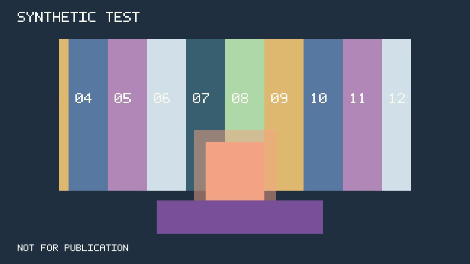

# T02 toolchain and synthetic rendering

Verified on 3 October 2026: Apple M5 Pro, 48 GiB RAM, macOS 27.0.1/arm64, Python 3.11.16, FFmpeg and ffprobe 9.0.2 installed externally through Homebrew. No FFmpeg binary is bundled or committed. The exact executable paths, hashes, build configuration and advertised capabilities are recorded in the [doctor report](evidence/t02-doctor-m5-pro.json).

## Reproduce

Run `make setup` first. Install the external tools with `brew install ffmpeg`, or configure another installation explicitly through the existing TOML/environment settings. [settings.macos.toml](../examples/settings.macos.toml) pins the tested Apple Silicon Cellar paths rather than following Homebrew's mutable symlink. If those paths are absent, install/select the intended build and rerun the checks; do not treat a different version as previously verified.

```sh
make doctor
make check
make test-media
.venv/bin/tabi --config examples/settings.macos.toml doctor --output-dir .local --json
.venv/bin/tabi --config examples/settings.macos.toml render-spike --output-dir .local/spikes --encoder libx264 --json
.venv/bin/tabi --config examples/settings.macos.toml render-spike --output-dir .local/spikes --encoder h264_videotoolbox --json
```

`doctor` defaults to the existing current directory; `--output-dir` selects storage to probe. It verifies a temporary write and available bytes without creating a missing directory. The 256 MiB minimum is a conservative bound for this tiny experiment, not a production storage estimate. Missing tools/capabilities return exit 3 with configuration/install suggestions; storage/I/O failures return 4. Tool versions must match. A report's `ready` flag means prerequisites were observed; `encoder_verification: listed_only` explicitly avoids claiming a successful render.

`render-spike` creates the requested output directory and a unique run folder. It stores `inputs/`, `doctor.json`, `graph.txt`, `command.json`, `probe.json`, three decoded PNGs, `report.json` and the verified `synthetic-test.mp4`. Failures retain diagnostics in `failure.json`, remove the owned temporary MP4 and never replace an existing export. JSON reports include machine identity, tool/input/graph/output hashes and measured checks. All MP4s remain local and ignored.

The core passes filenames as subprocess arguments, never as shell or filter expressions. The UTF-8 graph is loaded using FFmpeg's `-/filter_complex` option. Both CLI and tests exercise paths with spaces, apostrophes and Japanese characters. Process timeouts kill only the child created by that invocation; durable render jobs/cancellation are still T20.

## What is verified

The deliberately geometric scene is 960×540, 30/1 fps, 300 frames and ten seconds. Original bitmap lettering permanently labels it `SYNTHETIC TEST` and `NOT FOR PUBLICATION`. It uses no Tabi artwork or music.

- A numbered exterior strip moves at 60 pixels/second until frame 90, stops through frame 180, then continues at 120 pixels/second with continuous position.
- A grayscale window mask confines the exterior. A straight-alpha rectangle appears for frames [60,240), including transparent pixels with nonblack RGB and 50% edges. A foreground block occludes its lower edge.
- The final conversion uses BT.709 limited-range YUV420P, explicit color/alpha frame metadata, H.264 and stereo 48 kHz AAC. The owned WAV source is a ten-second 440 Hz tone with short edge fades.
- FFprobe checks streams, codec, dimensions, rational frame rate, all 300 timestamps and durations. FFmpeg fully decodes video/audio with decoder errors treated as failures.
- Eleven decoded frames straddle entry, exit, stop and restart. There are 110 color/alpha/mask checks (maximum allowed RGB-channel error 12/255) and 97 stripe boundary checks (maximum displacement error one pixel).
- Decoded audio length must be within one video frame of 480,000 samples, allowing AAC delay/padding differences. Each channel must have the expected RMS range and at least 97% energy at 440 Hz. On this build both outputs decode to exactly 480,000 samples.

VideoToolbox runs with `-allow_sw 0`, so success cannot silently use its software fallback. Only H.264 VideoToolbox was render-tested; advertised HEVC/ProRes/other accelerators remain unverified.

## Recorded results

| Encoder | Render subprocess wall time | Encoded bytes | Max RGB error | Max stripe boundary error |
| --- | --- | --- | --- | --- |
| libx264, veryfast/CRF 18 | 0.515 s | 366,665 | 2/255 | 0 px |
| h264_videotoolbox, 8 Mb/s target, software fallback off | 0.613 s | 387,268 | 3/255 | 0 px |

These are one-run measurements of a tiny low-complexity proxy. They exclude fixture generation and verification; they do not establish 1080p/4K performance, memory/CPU load, realistic art quality or hardware filtering. The encoder settings differ and this is not an equivalent-quality speed comparison.

Full reports: [software](evidence/t02-software-m5-pro.json), [hardware](evidence/t02-hardware-m5-pro.json). Their `output` fields identify the local ignored clips. Representative decoded frames were visually inspected for masking, transparency, occlusion and watermark legibility:




`make check`: 122 passed; seven media tests intentionally skipped. `make test-media`: seven passed with no skips on this Mac. The media suite renders both encoders, rejects a truncated export, confirms failed verification cannot publish output, and rejects actually rendered composites with an inverted mask, wrong alpha declaration, early entry or wrong post-stop speed. Elsewhere, software media tests remain required when opted in; optional VideoToolbox tests skip with a reason if not on a capable Mac. Such a run never establishes target-Mac verification.

## Remaining gates

M0 is complete. This fixed experiment is not a reusable scene renderer or the T04 fixture pack. Alpha-capable video interchange, real asset normalization, noninteger frame-rate media, audio mastering, browser playback/seeking, resumable jobs, crash cleanup, resource benchmarks, and final export quality remain their later tasks. There is no production or artistic approval, and no publication action occurred.

References checked during implementation: [FFmpeg filter documentation](https://ffmpeg.org/ffmpeg-filters.html), [FFprobe frame/stream reporting](https://ffmpeg.org/ffprobe.html), [Homebrew FFmpeg formula](https://formulae.brew.sh/formula/ffmpeg). Installed `ffmpeg -h filter=setparams` and `ffmpeg -h encoder=h264_videotoolbox` were also inspected; output verification established the behavior of this specific build.
