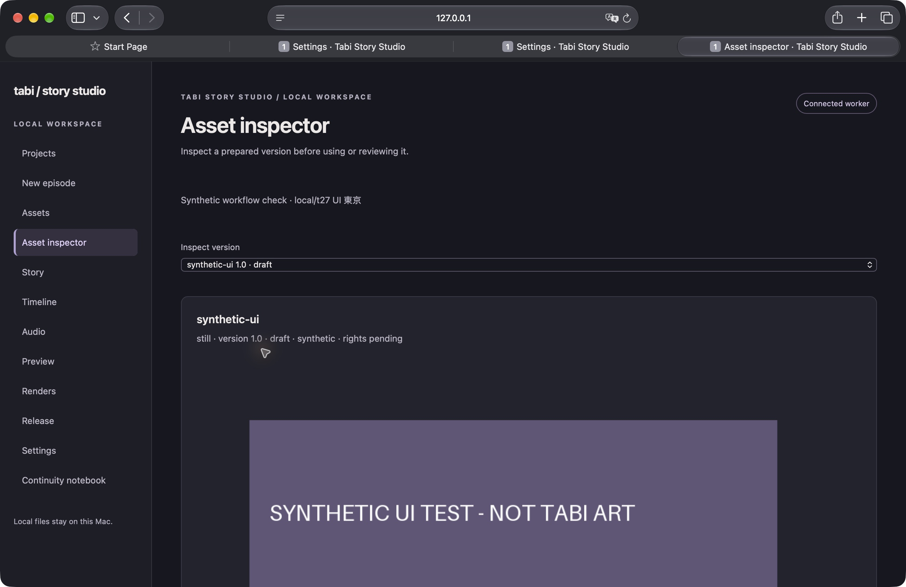
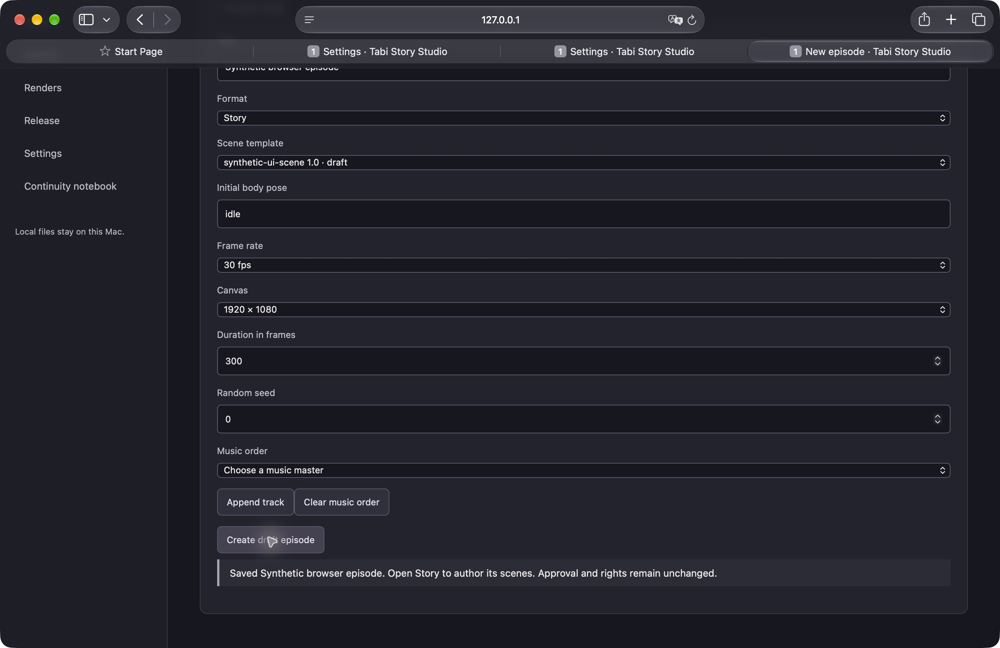

# Projects, assets and episode setup

Launch using the [local service guide](25-local-service.md). Projects uses a server-backed folder chooser; the launcher controls the available roots. Creating a project requires a new folder name. Reopen restores a recent location; Relink requires the same project ID at its new registered location. Recent locations live in `settings.cache_root/launcher/projects.json` and survive ephemeral worker ports. This small JSON cache is disposable; project documents and sources are authoritative.

Assets imports selected files or dropped files in bounded 4 MiB chunks. Reselect the same files to resume after interruption; the worker compares existing bytes, rejects differences and verifies the finished file before copying it into versioned sources. The local copy needs space for staging plus the source. Use Discard staged uploads for abandoned copies. Browser closure does not delete staging. No browser filesystem extension is required.

Inspect an asset to view its actual source, hash verification, media probe, provenance, compatibility and approval state. Source index selects sequence frames; images support an alpha checkerboard and optional proxies. Prepare proxies makes colour-managed PNG previews in a new version and retains original media. Edit provenance/compatibility by creating a new draft version. Relink matching source bytes uses ordered registered-root paths and checks every original hash. Changed bytes require a new import.

Approval records the reviewer's supplied name/note against the displayed content hash. Synthetic/unknown provenance, pending or forbidden rights, changed media and already approved versions cannot receive another approval. Importing authored metadata cannot assert approval. No workflow infers a licence or creates release identifiers.

Assets → Review templates and action packs shows the exact metadata and its content hash.
Review source media first, then its scene template, then the action pack. Recording metadata
approval rechecks every dependency through the production compiler, including camera, outfit,
channel, alpha, dimensions, frame count, frame rate and anchor compatibility for packs. A stale
hash or concurrent edit fails without recording approval. Approved versions are immutable;
import an explicitly newer draft version with revision zero and draft approval to change one.
This approval records the operator's visual review; it does not perform or replace that review.

To begin with an image, use Create still scene template in its inspector. Multi-layer scene templates and action packs can be imported as schema-validated draft JSON from Assets. New episode selects a registered template, rational frame rate, canvas, duration in integer frames and ordered music. Python places complete songs in integer samples and rejects an overlong selection. Draft scene inputs remain draft. Story editing, production review and release preparation are subsequent workflows.

Verification on the M5 Pro: Chrome created a project with spaces/Unicode; Safari selected a labelled synthetic PNG through the native picker, streamed it to the local worker, inspected it, created a template and saved a 300-frame episode. The PNG bytes remained equal to the registered hash. Automated HTTP checks cover chunk retry/restart, changed bytes, incomplete uploads, content limits, CSRF, path traversal, immutable versions, proxies, missing source relink, project identity and stale document revisions.

