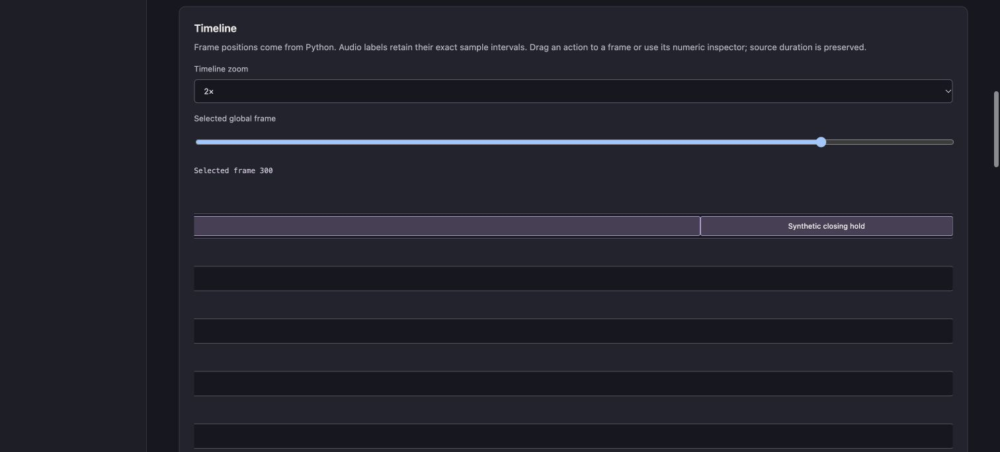
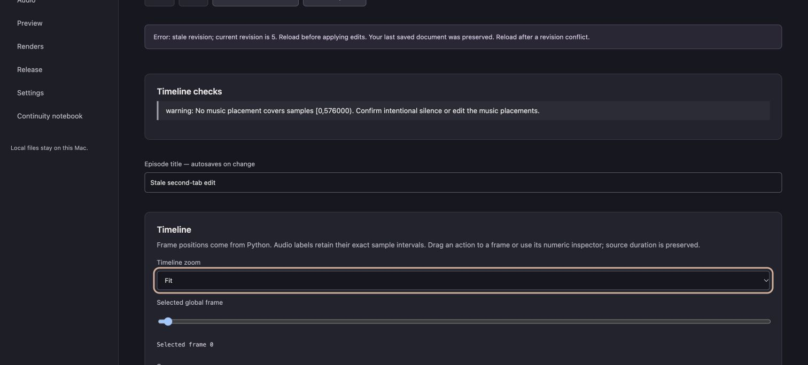

# Story and timeline editing

Open a project and choose an episode. Story and Timeline show the same saved core document, scene cards and seven lanes: scenes, music/ambience, body, face, persistent objects, travel speed and light/weather. Audio retains exact sample labels; its lane endpoints are only a Python-computed frame display. The selected integer frame and zoom persist through navigation. No browser compositor or FFmpeg command generator is used.

The title and scene-purpose fields autosave after a 450 ms typing pause or blur. The save indicator distinguishes pending, saved and failed edits. Actions and structured inspectors submit one coherent command. Every command validates schema and compiler semantics before an atomic revision-checked save, with a last-known-good backup. A failed command preserves the last saved file. Two tabs cannot silently overwrite each other: reload after a stale revision and reapply the intended edit.

Scene append uses the previous compiled final state, preserving carried objects and travel state. Select an appropriate prepared body action when the new template has a character. Music and earlier actions keep their original positions. Move cut boundary changes only the two adjoining scene endpoints; dependent clips that no longer fit must be edited explicitly. Paired overlaps and broader changes can be applied through the complete-episode JSON inspector. The compiler enforces transition policies.

Drag an action onto a lane position to snap its start to an integer frame, or enter its start in the numeric inspector. Python preserves its duration and rejects conflicts, unsupported poses/props, gaps in required body coverage and incompatible sources. Registered action packs supply action identity/version, channel, loop kind and prepared clips. Actions are never synthesized or stretched to hide a timing problem.

The keyframe inspector exposes only declared template parameter limits. Enter explicit global-frame keys, units and constant/linear interpolation. Story beats link real scene intervals and music placements. The notebook records summaries, previous episode IDs, object identities and manual notes; it never invents narrative continuity.

Undo/Redo (or Command/Ctrl-Z outside typing controls) restores document content as a new saved revision. It is limited to the current browser session and the last 100 accepted commands; restart recovery uses the persisted document/backups. Imports and render jobs are outside document undo. Closing during an unsaved autosave or pending command triggers the browser's standard warning where supported. Structured JSON forms require Apply before navigating away.

The M5 Pro verification used a labelled synthetic still, two scene intervals, title autosave, undo/redo, saved notebook notes and two competing Chrome tabs. It makes no creative approval claim. Automated checks also use the moving synthetic character fixture to prove duration preservation, impossible-action rejection, invalid curve rejection, exact sample labels and HTTP revision handling.

