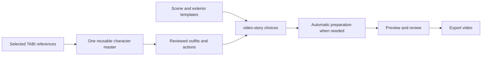

# Repeatable TABI production with an almost automatic workflow

Revised 5 October 2026; **native Blender appearance rejected; Flow continuity trial selected**.
Build videos with a consistent character, reusable visual references and coherent scene motion.
Cover train interiors/exteriors, outfits, actions, a café and walking without repairing frames
or writing scripts for each video.

## Current decision and scope

Marco's latest request changes the priority from another ear repair to a repeatable production
workflow. He explicitly requires **almost entirely automatic setup**, and accepts using several
applications. Do not assume he will draw layers, paint skin weights, learn rigging or commission
an animator. The existing calm-window video remains the preferred visual reference; it is not
a reusable character master and its unresolved flicker is not accepted.

The latest constraint is **no additional paid apps**. The next investigation must use free
commercial-compatible tools and existing Blender/Google entitlements, with no new subscriptions,
paid plugins, licences or credit top-ups. Existing Colab allowance is finite; an exhausted
allowance is not permission to buy more. Paid Meshy/Tripo Studio generation is outside the
current route. This changes tool selection without relaxing the likeness or automation gates.

This revision supersedes the previous instruction to repair the ears before addressing the
product. PLAN/progress/index now place P01 first. Marco authorized a Colab/Blender trial and
required monetization licence checks. Both [TripoSR](evidence/p01-character-pipeline.json)
and [SPAR3D](evidence/p01-spar3d-trial.json) generated real meshes but failed the character's
depth/anatomy requirements; neither qualifies preparation integration. The authorized
[eight-view correction](evidence/p01-turnaround-trial.json) also failed: a new volumetric front
reference did not fix the rear, and approximate multiview shape guidance distorted the body.
P01 remains the next production decision. T40 is independent engineering work,
but import improvements cannot establish that character creation works.

Marco then tried native Blender + Colab and **rejected its appearance as insufficient**. He now
requests **Google Flow**, using his existing higher-quality TABI work as the starting point.
The [Flow checkpoint](#next-checkpoint--google-flow-continuity) supersedes further native-model
refinement. The saved Blender trial remains technical evidence, not an approved creative result.
TRELLIS is also deferred. No replacement character design is authorized by a missing Flow asset.

**Current investigation:** continue one selected Flow clip, inspect every join and test gradual
identity drift before scaling to 90 seconds. Keep one camera, outfit, cabin, cup and exterior
travel direction/speed. The same character references help new scene setup; they do not fix the
temporal state of a preceding clip. The proposed initial test uses sequential Extend operations,
not independent text-only generations. A 90-second uninterrupted result is a feasibility target,
not an established Flow capability with TABI. Do not substitute cuts or a montage without agreement.

The [source review and ready-to-use prompts](evidence/p01-flow-continuity-review.json) record the
user's project link, current feature restrictions, commercial-use sources and bounded test.
Automatic approval review could not inspect the Flow tab because its review service was at
capacity; no generation occurred. Live model, selected clip, project contents and credit balance
remain unverified. The existing no-purchase constraint still applies.

## Tools and responsibility

Official documentation checked on 5 October 2026. Feature availability is vendor evidence;
the TripoSR and SPAR3D diagnostics are recorded below. Rigging and the remaining reuse stages
are untested with TABI.

| Tool | Proposed responsibility | Evidence and limit |
| --- | --- | --- |
| TripoSR on Colab, tested diagnostic | Generate one persistent mesh without a paid image-to-3D service | [Actual trial and licence record](evidence/p01-character-pipeline.json): MIT code/weights, CPU mesh extraction with scikit-image, eight Blender views. First candidate rejected for shallow geometry and lost TABI details; no rig or production workflow qualified. |
| SPAR3D, second tested diagnostic | Generate one mesh on Colab and inspect it in local Blender | [Measured trial](evidence/p01-spar3d-trial.json): exact code/model/dependency route reviewed under user-confirmed revenue eligibility and commercial registration. Mesh generated in 7.666 seconds after loading; eight unedited views fail depth/anatomy checks. No rig, new garment or production workflow qualified. |
| SPAR3D, bounded correction completed | Test a new volumetric reference with and without shape guidance from eight generated views | [Paired correction](evidence/p01-turnaround-trial.json): same front image/seed; image-only front recognizable but rear wrong; point-cloud prior adds depth but merges/distorts gills and tail/body. Sixteen real Blender views; both no-go. Whole-session displayed delta 0.37 units; runtime released. Generated references remain useful drafts. |
| TRELLIS 1, deferred | Previously proposed multiview coloured-mesh route | [Pinned source review](evidence/p01-next-route-review.json) remains available. Not selected under the latest Blender/Colab-only direction; no weights or inference run. |
| Native Blender study, appearance rejected | Authored geometry and baked motion; Colab rendered the saved file | [Measured trial](evidence/p01-blender-native-trial.json): 15-second local video and three cloud poses; subsequent user rejection is recorded in progress. No further refinement selected. |
| Google Flow, current trial | Continue an existing preferred TABI clip and reuse references for future scenes | [Continuity review](evidence/p01-flow-continuity-review.json). Existing subscription only; no live clip review or generation yet because browser approval review failed at capacity. Full 90-second continuity and app integration remain unproven. |
| Meshy / Tripo Studio, previous paid candidates | Historical alternatives | Excluded from the current route by the no-additional-paid-apps preference. No paid trial or subscription authorized. |
| Blender, local preparation | Apply a tested illustration-like material/camera, reusable motions, compatible wardrobe and prop contacts; render clean frames through a repeatable template | [Manual](https://docs.blender.org/manual/en/5.0/), [reusable Actions](https://docs.blender.org/manual/de/5.0/animation/actions.html), [toon shading](https://docs.blender.org/manual/sl/4.5/render/shader_nodes/converter/shader_to_rgb.html). These capabilities do not imply an existing automatic TABI template or verified performance on this Mac. |
| video-story | Library, compatible scene/outfit/action choices, routine timing, continuous exterior travel, preview, music and verified export | Existing core is useful; P02–P04 and T40–T48 below close the handoff. Normal production must not require opening Blender or editing metadata. |
| Logic | Finish original music and supply its local master when needed | Keep the selected master intact. Picture can be tested silently; music polish remains deferred. |

Moho Pro supports [PSD-based 2D rigging and Smart Bones](https://moho.lostmarble.com/products/moho-pro-14)
on macOS, but authoring the character is substantial setup, so it is not the default under the
latest constraint. Cartoon Animator's current download lists
[Windows requirements](https://www.reallusion.com/cartoon-animator/download.html), so it is not
the native Mac route. The authorized trials used existing Colab Pro+ resources and local Blender;
uploads were limited to generated TABI references, the derived shape prior and trial code/notebooks. No new purchase,
subscription or private-music upload occurred. The first trial's unit consumption was unmeasured;
SPAR3D records whole-session balance observations. Paid-provider trials are outside
the current route. The standard TRELLIS.2 setup is excluded pending replacement
of its non-commercial dependencies; main-repository MIT licensing alone does not clear it.

TripoSG also remains unqualified: its [NOTICE](https://github.com/VAST-AI-Research/TripoSG/blob/main/NOTICE)
identifies BRIA and Tencent-derived components despite the MIT top-level licence. Transparent
input could avoid background removal but does not resolve the other component terms. Do not
promote either stock pipeline as commercially cleared or replace one dependency and assume
the whole route is cleared. These are preliminary source checks, not executed candidates.

The new review also excludes Hunyuan3D-2mv from the proposed worldwide-video route: sections
1(l) and 5(c) of its [pinned current licence](https://github.com/Tencent-Hunyuan/Hunyuan3D-2/blob/f8db63096c8282cb27354314d896feba5ba6ff8a/LICENSE)
expressly restrict outputs/results in the EU, UK and South Korea. This conclusion concerns the
planned distribution, not an assumption about Marco's residence. Stock InstantMesh is not
selected because its default Zero123++ weights are non-commercial for a product pipeline;
the [official distinction](https://github.com/SUDO-AI-3D/zero123plus#license) allowing outputs
does not clear that integrated pipeline. A reconstruction-only adaptation would need its own review.

## What becomes reusable

| Requirement | Reusable input and normal operation | Boundary to make visible |
| --- | --- | --- |
| Same TABI throughout | One versioned character master; rendered complete character frames from it | Reject likeness/deformation defects before adding the master to the library. Do not regenerate the head for each action or outfit. |
| Different train interiors | Compatible cabin templates with camera, seating position, table height, masks and foreground | A new perspective or table position needs a qualified template/contact setup; it is not just a replacement background. |
| Different views outside | Independent exterior/parallax library, measured strip coverage and one global travel phase | New panoramas need matching horizons and reviewed joins. The 90-second baseline does not prove an endless wrap. |
| Different outfits | Garment/material variants bound to the same character, tested against its actions | Recoloring differs from a new garment shape. A coat cannot be treated as a texture on a T-shirt. Test a genuine silhouette change before claiming wardrobe support. |
| Different actions | Breathing, looking, drinking, music sway, large breath and walking with known entry/exit and prop states | A generic motion preset does not establish cup contact, facial motion, seating or a seamless transition. Missing actions require a new reusable action, not per-video repairs. |
| Café | The same master in a seated café template with different seating/table contact and matching props | Reuse motion only after contact/perspective compatibility; preserve one visible cup as ownership changes. |
| Walking | A tested walk cycle, fixed side/follow camera, grounded feet and synchronized ground travel | First release is a defined walking template. Free navigation, stairs, arbitrary cameras and contacts require additional templates or a later renderer extension. |
| A completely new scene | Add one versioned scene template with supported cameras, actions, outfits and contact points | Existing library choices are automatic; arbitrary unseen scenes are new preparation work. Report honestly if automatic preparation fails. |

Authoring may use a skeleton, separate garments and body parts internally. Rendering must
produce one coherent character with correct occlusion. The earlier duplicated arms and neck
gaps do not prove that rigs are unsuitable; they show that those experimental cutouts lacked
a consistent master and correct layer ownership. No independent replacement ears, extra arms
or flat cup overlays are added to already complete character frames.

## The workflow Marco should see

**Library setup, only when something new is needed:** select references or a prepared bundle →
automatic preparation → review the short movement test → save the reusable version. Expose
whether an item is ready, needs review, or is incompatible; never present raw frame folders
and technical IDs as the normal experience.

**Each video:** choose Train / Café / Walk → choose the compatible environment and outfit →
choose a routine and duration → preview → export. Add finished music whenever ready. Defaults
cover the frame rate, camera, action transitions, breathing, travel, output and cache behavior.



Home offers **New video**, **Continue** and **Library**. The normal creation steps are **Scene →
TABI and actions → Length and music → Preview → Export**. Imports happen inside the relevant
library/scene choice. Advanced retains the current timeline, inspector, exact parameters,
generation and diagnostics. A new user should not need to discover an order among 12 tools.

## A bounded proof before more product promises

### Monthly production and compute budget

Marco's current target is **30 videos per month, about 90 seconds each**, with a new combination
and some new assets for every video: 45 minutes of finished footage monthly. The number and
complexity of new assets are not yet fixed. The
[5 October account check](evidence/p01-colab-capacity.json) verified **2,000 Colab compute units
per month** from the existing Google AI Ultra plan and **2,499.4 units currently available**.
Use the recurring grant for sustainable planning; the extra balance is not an established
monthly entitlement. Flow/Gemini credits are separate.

Propose a 400-unit reserve and a 1,600-unit production budget, averaging **53.33 units per
episode**, including allocated setup and asset-generation costs. Other Colab work must reduce
that budget. These are planning limits, not measured consumption or implemented app controls.
At 10/25/50/70 units per episode, 30 episodes would use 300/750/1,500/2,100 units respectively;
none of these scenarios is a measured forecast.

Keep the qualified character, motions and generated assets locally. Use Colab only for the
new asset preparation that needs it, then use local Blender and video-story for frame rendering
and final composition. Local renders consume no Colab units; compatible saved combinations do
not require cloud regeneration. This proposed split still depends on P01's visual, automation,
licence and performance gates. The current allowance looks suitable for investigating this
route, but does not yet prove 30 complete productions per month. Colab is a bounded notebook
preparation tool, not an assumed always-on backend for the app.

The next licence-cleared trial must measure the accelerator/rate, before/after unit balance
and full connected time, including setup, downloads, retries and idle intervals. Separate the
one-time master/library cost from recurring per-episode additions. Rehearse a representative
new-assets episode and a saved-assets episode; record local render time and hands-on operations
separately. The rejected TripoSR mesh's 11.475-second inference cannot price a finished video.
No credit purchase is authorized if the measured workload exceeds the existing allowance.

### Character feasibility proof

The following master/rig proof describes the earlier 3D route. It is paused after the native
appearance rejection. The selected Flow route uses the separate bounded continuity checkpoint
below, while retaining the user-facing likeness, contact, garment, scene and workload requirements.
Alpha extraction and a mesh rig are not requirements for a complete-scene Flow result; independently
editable backgrounds remain a product gap that must be stated rather than silently assumed.

P01 is a single feasibility decision with predefined outputs, not an open-ended series of
90-second repairs. Start with at most two candidate masters and one correction round, using
zero additional software/service spend and only the existing available compute allowance.
Complete the exact model/dependency/output licence check before another model download or run.
Stop if the route needs frame painting or manual
mesh/weight editing to meet the baseline. Record user clicks, preparation operations, elapsed
time and cost; do not label an assistant performing hidden manual repairs as automation.

1. **Likeness and deformation:** render the real master in the current train view and a walking
   view. Test breathing, a head turn and a short walk. Review face, frill count/roots, neck,
   headphones, tail, feet and painterly texture against the supplied references.
2. **Hard reuse cases:** use the same master in train and café; fit a second, visibly different
   garment; lift, sip and return one cup; test a visible deep breath. No regeneration of TABI's
   identity and no manual frame repair. A recolor alone does not pass the outfit requirement.
3. **Production rehearsal:** create a 90-second train video, then change interior, exterior,
   outfit and routine independently; make short café and walking videos. Reuse saved settings
   after restarting. Before integration, run this through one documented preparation entry
   point; after T48, the same tasks must work entirely in the app.

Proceed to P02–P04 only if the resulting look and amount of manual work are acceptable. If only
some examples pass, list those capabilities; do not silently drop walking, clothing or drinking
and call the overall workflow complete. Exact reproduction of the current 2D style and almost
automatic preparation are not both established by any research or test performed here.

## Can the normal app workflow produce this video?

**5 October assessment: prepared 2D composition/export works; automatic source-to-video does not.**
The calm baseline uses the real compiler, independent travel curve, full-character PNG
sequences and durable export jobs. Its cabin separation, cutouts, pose bridges and animation
pack were prepared with local scripts outside the UI. Importing a flattened scene or imperfect
cutouts does not reproduce that preparation. PNG proxies only normalize preview media; they
do not repair ears, reconnect anatomy or make incompatible actions consistent.

| Step | Current capability | Work needed for the intended workflow |
| --- | --- | --- |
| Prepare matching character, scene, wardrobe and actions | One-off external scripts; no demonstrated reusable master or automatic wardrobe/rig | P01 tests the actual foundation; P02–P04 turn a successful preparation route into a reusable app service. |
| Import and bind the library | Media import and authored template/action/episode JSON | T40–T44: bundle import, named scene recipes, compatibility and saved routines without hand-written JSON. |
| Set timing and continuous scenery | Python compiler, curves and editor already support it | T43–T45: expose safe routine/duration/travel defaults, fit only compatible complete actions, keep the exterior on one global clock. |
| Preview and export | Real preview, frozen snapshots and verified export jobs exist | T46–T48: one guided path and a fresh-project walkthrough using the reviewed train pack. |

The current `ActionPack` is bound to one exact template, camera, outfit, canvas and frame rate.
The outfit switch in `EditorService` changes prepared clips, not the clothing on a live model.
`FFmpegRenderer` positions character frames at fixed anchors; there is no 3D import, rig engine,
general character path or arbitrary animated-background slot. Café/activity fixtures prove
compiler behavior using simple geometry, not real TABI quality. The optional local ComfyUI
adapter has no qualified real generation workflow and is not a Meshy/Blender integration.

Keep Python as the only timing/composition authority. The proposed first integration runs
Blender as an asset-preparation tool over tested templates, exports complete character PNG
sequences and prepared scene layers, and binds them to the existing compositor. It does not
introduce a second timeline in the browser. Versioned outputs are cached by master, outfit,
camera, motion, renderer and preparation settings. Changing scenery alone reuses TABI frames.
A new camera or garment can require a new bake, not a new character identity.

The first walking template uses a fixed follow camera and prepared in-place cycle with ground
travel matched to its stride. Do not pretend fixed anchor support implements arbitrary walking
paths. New spatial behavior must either be baked in a qualified template or specified as a
separate renderer change after the pilot; hiding it in a script is not product support.

**Latest Flow route:** the Blender-specific integration above and P02–P04 below are paused,
conditional designs. A successful complete-scene Flow video needs a separately specified import,
continuation-history and assembly handoff. The existing `ActionPack` cannot stand in for a whole
video with baked scenery. Provider API access, included-credit API coverage and unattended Flow
generation have not been established. Initially Flow performs generation and Scenebuilder review;
the proposed app role is to manage references, action plans, imported results, local music and
verified export. Rework dependencies/contracts after the continuity proof, before implementing.

## What the repository explains about the confusion

| Current implementation | Required change |
| --- | --- |
| `web/src/main.ts` builds navigation from all 12 entries in `web/src/wireframes.ts` | Separate workflow steps from tools and historical playback-spike layouts |
| `web/src/assets.ts` exposes ID, version, media kind, fps numerator/denominator, provenance and JSON at import | Detect technical facts; ask for the asset's role and only unresolved information |
| That importer sends fps for both sequences and video; `probe_media()` accepts explicit fps only for sequences | Probe video timing and omit the override; cover this actual mismatch in T40/T41 |
| Still-template creation is inside the inspector; layered templates/packs require JSON import | Offer visible scene recipes and create the underlying documents in Python |
| `SceneTemplate` already has ordered slots, masks, anchors and capabilities | Build a bounded authoring interface over these contracts |
| The renderer requires scene-sized still/mask layers and compatible prepared character clips | Prepare explicit derived layers and explain incompatibilities before rendering |
| `NewEpisode` requires frame duration; `AudioEditor` rejects music longer than the scene | Add an explicit music-length proposal for generated standard scenes |
| Preferences cover export, encoder, theme and cache, but not the whole creation flow | Add reusable technical defaults; keep source facts and approvals separate |

## The proposed import experience

For normal production, choose an existing library item or import one prepared bundle. Raw-file
import remains available for adding references, backgrounds and music; it is not the main
character-creation workflow. Drop/select files → see grouped thumbnails → choose what each
group is for → **Import and use**.
Each card shows a friendly name, detected dimensions/type, animation length when known, and
one next action. A folder of consecutively numbered frames becomes one proposed animation,
not 97 independent assets. Unrelated stills remain separate assets.

Role choices: **Complete scene image**, **Background**, **Tabi animation**, **Foreground**,
**Window mask**, **Scenery strip**, **Music**, or **Reference only**. A role is the user's intent;
file type, dimensions and alpha are measured facts. Transparency alone cannot establish a role.
Ambiguous groups, missing sequence frames and unknown timing get specific explanations beside
the affected card. Advanced metadata stays collapsed. Pending rights never prevent a draft preview.

| Parameter | Proposed default / automatic behavior | When a choice is needed |
| --- | --- | --- |
| Asset name/ID/version | Name from filename; Python allocates a safe collision-resistant ID and initial `1.0` | Friendly name may be changed; replacing an existing asset creates a new version |
| Storage | Copy into the current project; preserve originals | Linking an external drive is Advanced |
| Media type and dimensions | Probe actual bytes; group a sequence by naming/order and matching media properties | Ambiguous file groups require confirmation; do not use extension alone |
| Video source fps | Read the actual source rate | Unsupported/variable-rate sources need explicit preparation, never an assumed 30 fps |
| PNG sequence source fps | Reuse a supplied manifest or the explicitly selected known export preset | Otherwise ask once in plain language; a PNG folder has no timing metadata |
| Alpha / mask meaning | Detect alpha; validate masks as raw grayscale, white visible | Do not infer a window mask from any grayscale image or remove a background automatically |
| Provenance / rights | Preserve supplied facts; unknown creator/history stays unknown, rights pending, approval draft | Human confirmation is needed for factual rights/approval; JSON is not required for ordinary import |
| Compatibility | Derive from the chosen recipe and checked assets when binding the scene | Never mark an unrelated camera/outfit/clip compatible just because its name says Tabi |

## Build the scene visibly

Keep raw assembly recipes in Library/Advanced. Normal creation shows tested Train, Café and
Walk templates with compatible choices. The underlying assembly recipes remain:

| Recipe | Inputs | Result |
| --- | --- | --- |
| **Complete image** | One finished scene still | A static scene ready for music; no invented animation |
| **Character over background** | Background without a baked-in duplicate character; prepared transparent character animation; matching foreground when its cutout needs occlusion | Tabi's reviewed prepared motion over the selected scene |
| **Layered train** | Prepared cabin/background, window mask, compatible exterior strips, character animation and foreground | A composed train scene with optional supported movement; missing layers listed individually |

Café binds its own seating/table/prop geometry. Walk binds its reviewed camera, floor, stride
and ground speed. A new photo of a café or street is reference material until these constraints
have been prepared; the app must not claim to understand contacts from an arbitrary image.

The builder shows the rendered scene on the left and a short ordered layer list on the right.
Choose/replace assets by thumbnail, toggle supported layers and position the character through
an anchor control. Python validates placement and produces the updated still. Basic options
are **Keep image proportions** (default), **Fill frame** (explicit crop preview), **No motion**
or a reviewed animation loop. Scenery movement appears only for valid prepared strips with
declared periods; weather appears only for templates with the necessary artwork/masks.
No general rig editor, automatic cutout extraction or independent browser compositor is added.

The legacy import examples below remain useful diagnostics, not the proposed production master:

| Supplied source | Guided example and limit |
| --- | --- |
| `docs/assets/scenario/tabi-train-example.png` | “Use as complete scene”: 1664×936 flattened RGB image, fit to a 1080p output. It already contains Tabi; putting another Tabi on it would duplicate the character. |
| `docs/assets/tabi-assets/train-actions/breath/` | Group 97 RGBA frames at 1920×1080 into one character-animation candidate. Ask for the actual source rate and inspect its loop seam; do not claim 30 fps from the file count. Existing blinks mean no second blink overlay. |
| `docs/assets/tabi-assets/train-actions/drink/` | Group 129 frames as an action candidate. Drinking changes cup/pose state; do not loop it automatically or silently offer it as an idle loop. |
| Train/Tokyo panorama references | Explain missing cabin/window/foreground separation and unreviewed tile seams. Landmarks baked into a panorama cannot be treated as endlessly repeating neutral scenery. |

The [source audit](09-implementation-review.md) records a table-shaped missing region in the
character cutouts. The app must explain the need for matching foreground or repaired source
art instead of suggesting arbitrary placement will work. Draft composition previews may reveal
this problem; they are not artistic approval. The existing assets do not supply a finished
animated train pack simply by being imported.

## Standard video defaults

These are proposed starting values, editable under Advanced. They do not change an existing
episode automatically. A saved scene retains exact versions and its reviewed timing.

| Function | Starting behavior |
| --- | --- |
| Video format | One-scene `session`, 16:9, 1920×1080; one saved scene reused across the music |
| Frame rate | 30/1 for still scenes; use the selected compatible animation pack's actual supported rate for animated scenes. Show a source-driven exception such as 25 fps in the summary; never reinterpret 25 fps as 30. |
| Scene canvas | Preserve source design geometry; fit the complete composition into the output. Derived layer preparation uses one explicit transform for aligned background/mask/foreground groups. |
| Duration | Full length of the selected ordered music; no song stretching, trimming, repeats or fixed 30–60-minute target |
| Before music | 90-second visual-test preset plus a 10-second quick preview. Explicit duration works without music; adding music can propose its full length. |
| Character | Breathing enabled in each qualified routine, including rest; default train rest looks outside. Bake it together with the action so it cannot disconnect the head/neck or duplicate motion. Retain the old baseline as a separate comparison preset. |
| Action density | Calm by default: one complete secondary action around 36 seconds in the 90-second preset, long resting holds. “Action test” separately exercises look/sip/sway/look/deep breath at 15/30/45/60/75 seconds using compatible complete durations. Never silently cut an action to hit a cue. |
| Breathing | Proposed new-master starting cycle: six seconds, subtle chest/shoulder movement with hands/feet contact respected; larger explicit inhale/hold/exhale action. Visibility and timing must be visually qualified, not inferred from transform values. |
| Train scenery | One continuous travel phase across character blinks, action repeats and render chunks. Validate available strip coverage for the chosen duration; a short non-wrapping pass does not establish a seamless long-form loop. |
| Travel speed | Calm train starts from the reviewed baseline's 72 design-pixels/second. Slow/Normal/Fast map to each scene's qualified range. Walk speed is coupled to stride; it cannot reuse the train speed preset. |
| Weather / lighting / ambience | Off unless already authored in the selected saved scene; no invented rain or train noise |
| Audio | Complete masters in order, 0 dB gain, no added fades/crossfades or loudness remastering; 48 kHz prepared mix, original masters unchanged |
| Quick preview | 960×540, first ten seconds or shorter if the episode is shorter; optional loop-seam/other-range review |
| Export | Existing 1080p SDR H.264/AAC profile: 8 Mb/s at up to 30 fps, stereo 48 kHz AAC at 384 kb/s; use existing higher-fps profile rules |
| Encoder / queue | Existing saved encoder, otherwise `libx264`; one active export, existing 900-frame chunk cap hidden in Advanced |
| Output location | A unique file under the project's `exports/`, with the actual location shown before starting |
| Future videos | “Use saved scene” and “Save as my defaults”; default changes affect future drafts only |

Reuse a preset's technical settings. Never reuse a guessed source rate for unrelated files,
promote pending rights, copy snapshot approval to a new video, or silently update approved assets.

## Implementation conventions

P01 has two initial candidate no-go decisions and a completed paired correction, also no-go;
**overall feasibility remains open**. The bounded SPAR3D conversion trial is finished.
P02–P04 remain blocked on that proof, as reflected in the [active index](tasks/INDEX.md).
T40–T48 retain their
identifiers and useful engineering work, with expanded production gates. Domain operations
belong in Python; API and CLI call the same service. Retain strict unknown-field/version checks,
integer frames/samples, immutable versions and revision guards. New optional preference fields
must preserve loading and content hashes of legacy documents; use explicit backed-up migrations
if that is impossible. No database or parallel implementation lane is needed.

For each contract change, register the exact output models in `src/tabi/core/models/__init__.py`
or `src/tabi/api/contracts.py` as appropriate. Regenerate the named schema/type files and the
shared `web/src/generated/documents.ts`, `web/src/generated/validators.cjs` and
`web/src/generated/validators.d.cts` using `make schemas` and `make web-build`; do not hand-edit
generated validators. Each implementation task also updates `docs/progress.md` and
`docs/tasks/INDEX.md` with its verification and commit. New file paths are marked below.

<a id="p01"></a>

## P01 — Decide whether automatic character preparation meets the real requirements

Current action: [Google Flow continuity test](#next-checkpoint--google-flow-continuity).
The model trials below are historical; the later native Blender appearance was also rejected.

Status: first candidate trial recorded on 5 October. TripoSR produced a real GLB, but its
Blender views failed likeness/frill/anatomy checks. No rig, motion, contact, wardrobe or scene
reuse was attempted after that failure. [Comparison](evidence/p01-character-comparison.jpg),
[licences, exact hashes and operations](evidence/p01-character-pipeline.json). The verifier
checks evidence integrity and explicitly reports that production feasibility has not passed.

The second candidate's [SPAR3D trial](evidence/p01-spar3d-trial.json) is executed and also a
no-go. The L4 generated a real mesh in 7.666 seconds after a 26.463-second successful model load;
eight standard Blender views show a very shallow body/head and a visible tail gap. The
recognizable front does not qualify head turns, walking or wardrobe changes. No rig or motion
was attempted after the static failure. [Comparison](evidence/p01-spar3d-comparison.jpg).

Actual runtime dependencies and pinned code/model/configuration were reviewed. A compatibility
adapter checks the moved bounding-box buffer, legacy background constant and device sentinel
exactly; all current learned weights come from the verified SPAR3D checkpoint. No research-only
AlphaCLIP, standalone CLIP/DINO or background-removal weights were used. The executed notebook,
failed attempts and verified result bundle are local. Whole-session balance and release state
are recorded in the evidence; fast inference does not establish 30-video monthly capacity.
The historical [preflight](evidence/p01-spar3d-preflight.json) remains unchanged as an earlier
checkpoint. The remaining correction round has now run from
[eight generated views](evidence/p01-turnaround-reference-pack.json). SPAR3D consumes one
appearance image; its image-list interface batches independent meshes. The tested adapter
derived a 512-point approximate visual hull from all eight views and supplied it through the
supported point-cloud input. It did not jointly condition appearance on eight images.
[Actual comparison](evidence/p01-turnaround-comparison.jpg) and
[measured report](evidence/p01-turnaround-trial.json) record failures in both paired variants.
No rig, mesh repair or motion test followed. This is not evidence against every native
multiview method, but it ends this bounded route. Further model testing requires an explicit
revised strategy and exact commercial-licence/dependency review; do not keep rerolling SPAR3D.

### Next checkpoint — Google Flow continuity

User-selected [Flow project](https://flow.google.com/u/1/project/6b8a8a71-a9d3-4884-9ec7-87c77573b781).
Detailed prompts, review gates, budgets and dated official sources are in the
[Flow review](evidence/p01-flow-continuity-review.json). No new video has been generated.

1. Inspect the existing preferred clip and generation history. Save source identifiers, actual
   model/settings, prompt, reference images and a local original with hash. Establish a frame
   for TABI's identity and a short continuity record: camera, pose, hands, cup position, cabin,
   lighting and exterior direction/speed. Do not use the rejected Blender model as an ingredient.
2. Verify live Extend support and displayed credits. Current Google feature documentation says
   eligible Veo 3.1 clips extend using **Veo 3.1 Lite**, including clips originally generated
   with Fast/Quality. This can change the look; verify against the preferred source. An Omni
   source may need a saved-frame continuation instead, subject to a separate motion-join test.
3. First try up to three sequential continuations: breathing/hold, a gentle look outside, then
   hold. One output per call, one local repair attempt maximum, **20 included credits maximum**
   for this initial extension test at the currently documented 5-credit Ultra Lite rate. Prefer
   the equivalent zero-credit lower-priority mode only if actually offered to this account.
   Verify actual cost before each call; stop at the cap or unavailable credit balance. No purchase.
4. Measure the actual added duration and inspect the resulting roughly 20–30-second sequence
   at full size, every join and beginning/middle/end. Review ears, face, neck, arms, cup, scenery
   landmarks and speed. Reject a drifting continuation; never use its final frame as the next
   seed. Passing short joins does not establish long-run identity. Retain original versions.
5. Only after this passes, continue through the 90-second brief below. End-frame chaining can
   be tested when Extend is unavailable, but matching one image does not preserve velocity or
   panorama history. Scenebuilder arranges/trims footage; it does not fix temporal discontinuity.
   Stop and report a failed continuity requirement instead of hiding it with repeated scenery,
   backward playback, unrelated cuts or transparent cutout repair.
6. Download the assembled candidate and measure real fps/duration, decode integrity, full motion
   and every action/contact. Target exactly 90 seconds at a supported rational fps after assembly;
   generated beat timing is approximate. Record accepted footage versus all attempts, credits,
   elapsed time and human intervention before judging 30-video monthly capacity. Re-test a new
   scene, garment and action before qualifying the broader workflow or revising P02–P04.

The story target carries forward Marco's previous timing, with calm holds between actions:

| Target interval | Character beat | Continuous environment |
| --- | --- | --- |
| 0–15 s | Quiet seated breathing; establish the selected source pose | Continue the existing panorama and travel speed |
| 15–30 s | Gentle turn to watch outside, then rest | Same camera, cabin and daylight; scenery keeps moving |
| 30–45 s | Reach, lift the same cup, one sip, return it to the same place | No exterior reset during contact action |
| 45–60 s | Small relaxed head/shoulder sway | Continue the same route and speed |
| 60–75 s | Return to watching outside | New scenery arrives naturally along the route |
| 75–90 s | Visible deep inhale/hold/exhale, then a quiet finish | No abrupt destination/time-of-day change |

Breathing remains present between deliberate actions. Keep original music local for the final
edit; request no generated score or dialogue. Props and world layout must follow the selected
clip; these prompts require adaptation after actual visual inspection. If the source starts
in another state, construct a compatible lead-in rather than pretending the timeline already fits.

<a id="next-checkpoint--native-blender-master"></a>

### Historical checkpoint — native Blender master

Status: [bounded rendering trial completed](evidence/p01-blender-native-trial.json), then
**appearance rejected by Marco**. Further native-model refinement is superseded by the Flow trial.

Marco explicitly requested trying Blender and Colab without other external tools. The bounded
native study under ignored `.local/p01-blender-native-v1/` authors a new, clearly labeled 3D draft
against the existing illustrated and eight-view references. It must preserve the preferred
90-second video and must not be mistaken for a faithful automatic conversion.

1. Save one self-contained `.blend` with six fixed gills, native materials, one pair of arms,
   a connected head/collar arrangement, planted feet, and baked breathing/head-turn/sway/deep-breath
   channels. Produce a silent 15-second local motion study and eight transparent character views.
2. Reopen the saved master with automatic script execution disabled. Check all frames for camera
   margins and rigid gill attachments, verify actual video duration/decode, and compare the rendered
   anatomy/likeness against supplied artwork. Geometric checks do not prove artistic correctness.
3. Package that exact master and an explicit render script for a token-free, bounded Colab check
   using official checksum-verified Blender only. Record setup failures, runtime, resource balance
   and download integrity. Local EEVEE and cloud Cycles are separate rendering configurations;
   three cloud frames would establish portability, not monthly throughput or identical pixels.
4. Obtain a likeness decision before extending this master. Drinking with hand/cup contact,
   walking, a true second garment, café reuse, continuous 90-second rehearsal and app-driven reuse
   remain mandatory. P01 stays open and P02–P04 stay blocked. Record the authored setup burden;
   a simple local render command is not evidence that new assets or normal app production are solved.

Save compact evidence in `docs/evidence/p01-blender-native-trial.json` and a labeled comparison
in `docs/evidence/p01-blender-native-comparison.jpg`. Reuse the existing evidence verifier with
that new report; keep prior model reports immutable. Local scripts/notebook, `.blend`, video,
official licence/checksum snapshots and render logs remain in the ignored trial folder.

<a id="next-checkpoint--trellis-1-mesh-only-preflight"></a>

### Deferred checkpoint — TRELLIS 1 mesh-only preflight

This earlier investigation is deferred by Marco's subsequent Blender/Colab-only choice.

The [5 October source review](evidence/p01-next-route-review.json) pins TRELLIS code
`442aa1e1afb9014e80681d3bf604e8d728a86ee7`, weights metadata
`25e0d31ffbebe4b5a97464dd851910efc3002d96`, and Apache FlexiCubes submodule
`815e075a2a400d06c48d94c347674344ed6ae5c5`. The four required TRELLIS checkpoints total
2,664,021,360 bytes; DINOv2 and runtime packages are additional. These are published metadata,
not locally downloaded or verified weights. Model access is currently ungated.

1. **Verify the permitted execution path first.** Prepare one isolated mesh-only loader/exporter
   under ignored `.local/p01-trellis-mesh-only/`; record its reproducible source and dependency
   checks in a new `docs/evidence/p01-trellis-preflight.json`. The stock representation imports
   eagerly reach non-commercial Gaussian helpers, and the default loader instantiates all
   decoders. Requesting only mesh output is insufficient. Load only the four required components,
   pin the DINOv2 backbone without current hubconf's Cell-DINO imports, and use the native
   vertex-colour output. Exclude Gaussian/radiance-field renderers, their helpers and background
   removal weights. Verify exact installed dependency licences, forbidden-module absence,
   strict learned-weight coverage when loaded, and synthetic coloured-mesh export/import.
   Retain required notices. This route has not been implemented or run.
2. **Then propose one bounded visual trial.** After preflight passes and the revised model trial
   is authorized, use the existing front/back/both-profile PNGs, one fixed seed and documented
   sampler settings. Review against all eight saved references. Stop at 60 connected minutes or
   30 displayed compute units, whichever comes first; these are caps, not expected consumption
   or automatic quota enforcement. Use existing allowance only and record the full session.
   Save the unmodified coloured mesh and eight real Blender views. No seed search or hand repair.
3. **Keep the complete P01 gate.** Reject wrong anatomy/likeness at the static review. If it
   passes, separately qualify automatic rigging, a body/garment representation that supports a
   real second garment, and breathing/head-turn/walk/cup/deep-breath motion with train/café reuse.
   Native vertex colours may lose fine detail; official multi-image sampling is a tuning-free
   adaptation with uncertain results. A successful static conversion cannot close these gates.

The immediate outcome is a reproducible, licence-reviewed preflight; there is no cleared
ready-made workflow yet. Keep P02–P04 blocked and keep the earlier trial reports immutable.
An authored master remains a setup tradeoff if this route fails, not an assumed change to
Marco's nearly automatic requirement.

**Target files**
- `docs/evidence/p01-flow-continuity-review.json` (new) — dated source review, user route decision, prompt pack, limited test and unverified live facts; not a generated-media acceptance report.
- `docs/evidence/p01-blender-native-trial.json` (new), `docs/evidence/p01-blender-native-comparison.jpg` (new) — separate native-study evidence; source and media remain in ignored `.local/p01-blender-native-v1/`.
- `docs/evidence/p01-character-pipeline.json` (new) — reference/master hashes, exact tool versions, operations, manual intervention, local clip paths, timing/cost and each pass/fail decision.
- `docs/evidence/p01-character-comparison.jpg` (new) — supplied reference and actual rendered candidate, clearly labeled.
- `scripts/verify_character_pipeline.py` (new) — verify recorded media identity, dimensions, frame counts and reuse evidence; never grant visual approval.
- `tests/unit/test_character_pipeline_evidence.py` (new) — reject changed inputs, wrong dimensions, omitted gates, false go decisions and mismatched master identities.
- `PLAN.md`, `docs/progress.md`, `docs/tasks/INDEX.md` — record the selected route, current queue, measured automation and any failed requirements before further integration.

**Inputs / dependencies**
- No app task dependency. Current TABI references and calm-window baseline; Marco's almost-automatic requirement.
- Current Flow route: inspect the user-supplied project, selected source and live model/credits; use existing entitlement within the bounded test. Earlier 3D route: available supported Blender plus authorized inputs. No purchases or unrelated cloud uploads.

**Implementation rules**
- Execute the bounded proof above. Include an actual new garment shape, prop contact and walking; a stock humanoid, still turntable, recolor or idle-only clip cannot pass the requested scope.
- Preserve the selected character identity across all examples. For Flow, retain canonical references and a branch history of accepted continuations; for a master route, keep model generation distinct from motion rendering. Record every correction and reject dependence on recurring frame cleanup or specialist setup by Marco.
- Review complete motion, ear/frill roots, outlines, neck, hand/cup contact, clothing, feet and every transition. Test alpha over light/dark backgrounds only for a layered-media route; do not claim flattened Flow footage provides transparent character layers.
- Reuse saved references/settings in a second output and after reopening tools; a Flow generation must still be compared for drift. A persistent mesh route additionally requires reuse without rerunning image-to-3D. Qualify supported scene/outfit/action combinations, not arbitrary combinations.
- If the style, automation or hard reuse cases fail, record a no-go and the precise tradeoff. Do not start P02–P04 as though the requirement were solved. Preserve the existing app and original artwork.
- Keep all models, textures and videos in local project media storage; commit only compact factual evidence and the verifier. No provider credentials or guessed licences in reports.
- Measure recurring preparation with setup, rejected attempts and other account usage included. Track Flow credits separately from the historical Colab budget. Fast inference or a large balance alone cannot establish 30-video monthly capacity.

**Verification command**
```sh
.venv/bin/python scripts/verify_character_pipeline.py --report docs/evidence/p01-character-pipeline.json
.venv/bin/python scripts/verify_character_pipeline.py --report docs/evidence/p01-blender-native-trial.json
git diff --check
```
Also record Marco's visual decision and the observed operations needed to reproduce the second
video. The verifier cannot approve likeness or declare an unperformed trial successful.

<a id="p02"></a>

## P02 — Define a versioned handoff from the character library to prepared media

This and P03–P04 retain the earlier Blender-specific design for reference. They are blocked and
must be rescoped if the Flow route qualifies; do not implement them as Flow integration.

**Target files**
- `src/tabi/core/models/preparation.py` (new) — strict library manifest, preparation request/result and durable preparation-run documents.
- `src/tabi/core/models/__init__.py`, `src/tabi/core/persistence.py` — register documents and explicit storage paths.
- `src/tabi/core/preparation/library.py` (new) — inspect manifest dependencies and compatible combinations through registered roots.
- `src/tabi/core/portability.py`, `tests/unit/test_portability.py` — include masters, textures, motion and template sources in private project backup.
- `schemas/preparation_library.schema.json`, `schemas/preparation_run.schema.json`, `web/src/generated/preparation_library.ts`, `web/src/generated/preparation_run.ts` (new) — generated document contracts.
- `tests/unit/test_preparation_models.py`, `tests/unit/test_preparation_library.py` (new) — strictness, compatibility, paths and source identity.

**Inputs / dependencies**
- P01 passes the real-art/automation gate; existing `Asset`, `ActionPack`, `SceneTemplate`, integer-time and immutable-source contracts.

**Implementation rules**
- Store exact source hashes/versions for master, skeleton, garments, motions, renderer template, textures and preparation code. Include camera, scale, canvas, rational fps, alpha/color conventions, contact points, loop intervals, entry/exit poses, prop ownership and supported scene/outfit/action combinations.
- Distinguish texture variants from garment geometry. A compatibility declaration has its own review evidence; matching names or skeleton IDs alone cannot establish that a sleeve or cup clears the body.
- Represent preset motion and any generated motion as immutable inputs after review. Do not call cloud generation on every render. Keep provider metadata factual and secrets outside documents.
- Limit the initial handoff to the P01-qualified fixed-camera templates and complete-character render outputs. No general 3D editor, arbitrary executable plugin bundle or browser-side animation engine.
- A prepared folder manifest supplies timing and references; the importer creates project-local asset identities. Missing files, changed hashes, traversal and unknown major versions fail before installation.
- Preserve legacy projects and hashes; use new document types instead of repurposing existing action fields for 3D semantics.

**Verification command**
```sh
make schemas
.venv/bin/python -m pytest tests/unit/test_preparation_models.py tests/unit/test_preparation_library.py tests/unit/test_portability.py
make web-build
```

<a id="p03"></a>

## P03 — Prepare complete character actions from the same master with Blender

**Target files**
- `src/tabi/core/preparation/blender.py`, `src/tabi/core/preparation/verify.py` (new) — bounded preparation runner, content-addressed output and media verification.
- `src/tabi/core/preparation/blender_entry.py` (new) — shipped Blender-side script applying only qualified preset parameters and rendering frames.
- `src/tabi/core/config.py`, `src/tabi/core/toolchain.py` — optional Blender executable/version capability checks; existing FFmpeg-only projects remain runnable.
- `src/tabi/core/assets/service.py` — install verified derived media with source/preparation identities preserved.
- `tests/unit/test_blender_preparation.py`, `tests/integration/test_blender_preparation.py` (new) — cache invalidation, cancellation and actual small synthetic animation renders.

**Inputs / dependencies**
- P02 and P01's qualified master/template operations; available Blender executable and explicit supported version range derived from the trial.

**Implementation rules**
- Use subprocess argument arrays and the existing owned-process/cancellation utilities. Run only the shipped entry script; disable auto-execution of arbitrary imported scripts and restrict source/output access to registered project roots.
- Render complete body/face/held-prop actions with matching endpoints. Apply breathing inside the same rig evaluation; do not move a second head/body layer. Blend joint motion or use reviewed transition clips before baking, never ghost two complete character images.
- Produce scene-aligned straight-alpha PNG sequences at the declared fps/canvas with no baked exterior. Export static cabin/foreground layers separately. Ground/contact shadows must belong to the correct scene setup.
- Cache by every source, preset, camera, outfit, renderer/version and output setting affecting pixels. Scenery/music-only changes reuse character outputs; garment/camera changes invalidate only affected preparations.
- Validate all expected frames, sequence order, alpha convention and source hashes before atomic publication. A failed/cancelled preparation cannot replace the last usable library version.
- Run without a generation provider after the required sources are local. No model downloads or remote costs are triggered by preview/export.

**Verification command**
```sh
.venv/bin/python -m pytest tests/unit/test_blender_preparation.py
.venv/bin/python -m pytest --run-media tests/integration/test_blender_preparation.py
```
Run the media test with the actual P01 Blender executable; a skip is not passing evidence.
Compare two renders and a changed-outfit render, then inspect the real TABI action boundaries.

<a id="p04"></a>

## P04 — Make preparation a durable application operation

**Target files**
- `src/tabi/core/preparation/service.py` (new) — inspect/prepare/reuse/cancel/resume operations and durable preparation-run records.
- `src/tabi/api/preparation.py`, `src/tabi/cli/preparation.py` (new) — authenticated API and CLI adapters to the shared service.
- `src/tabi/api/app.py`, `src/tabi/api/contracts.py`, `src/tabi/cli/__init__.py` — register the adapters and typed status response.
- `schemas/web_preparation.schema.json`, `web/src/generated/web_preparation.ts` (new) — generated capability, progress, output and failure contract.
- `tests/unit/test_preparation_service.py`, `tests/unit/test_web_preparation.py`, `tests/integration/test_preparation_service.py` (new) — duplicate submission, ownership, restarts and media installation.

**Inputs / dependencies**
- P03; P02's run documents; existing project locking, authenticated worker, execution scopes and immutable media services.

**Implementation rules**
- Persist the exact request before execution and reconcile ambiguous replies/restarts by identity. Queue one expensive preparation/export at a time using worker ownership; never compete silently for Mac resources.
- Show which compatible library item will be prepared, what is cached, progress and a concrete failure remedy. Source preparation and FFmpeg export are distinct stages with factual status.
- Freeze a preparation's inputs, verify output before installation and preserve the last usable pack on failure. Reconnect after tab closure without submitting another run; cancellation affects only the owned process.
- Do not modify the existing FFmpeg job format to pretend Blender outputs are final MP4 exports. Reuse existing locking/process primitives with preparation-specific typed state.
- Return installed exact asset/pack references to the scene builder. No routine production step requires a console command, path copying or metadata JSON editing.

**Verification command**
```sh
make schemas
.venv/bin/python -m pytest tests/unit/test_preparation_service.py tests/unit/test_web_preparation.py tests/unit/test_web_service.py
.venv/bin/python -m pytest --run-media tests/integration/test_preparation_service.py
make web-build
```

<a id="t40"></a>

## T40 — Derive safe import choices in Python

**Target files**
- `src/tabi/core/assets/import_plan.py` (new) — typed inspection/grouping proposal and import resolution.
- `src/tabi/core/assets/probe.py`, `src/tabi/core/assets/service.py` — reuse actual probing and immutable import; preserve detected source timing.
- `src/tabi/api/uploads.py`, `src/tabi/api/workspace.py`, `src/tabi/api/contracts.py` — authenticated proposal/commit adapters and `WebImportPlan` contract.
- `src/tabi/cli/assets.py` — shared import-plan adapter.
- `schemas/web_import_plan.schema.json`, `web/src/generated/web_import_plan.ts` (new) — published inspection response.
- `tests/unit/test_import_plan.py` (new), `tests/unit/test_web_workspace.py`, `tests/integration/test_asset_import.py` — grouping, ambiguity, timing and actual media regression.

**Inputs / dependencies**
- None in this backlog. Existing `ImportRequest`, `probe_media`, `AssetService`, bounded upload receipts and source audit.

**Implementation rules**
- Inspect staged/registered files in Python; propose natural numeric sequence order, groups, measured facts, unresolved choices and safe IDs. Equal names alone never identify equal content.
- Separate unrelated stills; report gaps/duplicate frame numbers, inconsistent canvases and corrupt input on their group. Do not guess sequence fps or classify a pose collection as animation without confirmation.
- Send no fps override for video; retain probed rational timing. Revalidate facts/hashes on commit and refuse unsupported timing rather than reinterpreting it.
- Copy by default; retries are safe through existing receipts and immutable identities. Per-group success persists if another group fails. Reuse identical existing assets only when content and relevant kind/timing/metadata match.
- Provenance/rights remain factual and draft. Protect registered roots, CSRF and source bytes through both adapters.

**Verification command**
```sh
make schemas
.venv/bin/python -m pytest tests/unit/test_import_plan.py tests/unit/test_web_workspace.py
.venv/bin/python -m pytest --run-media tests/integration/test_asset_import.py
make web-build
```

<a id="t41"></a>

## T41 — Guide import with defaults and examples

**Target files**
- `web/src/assets.ts`, `web/src/workspace.ts`, `web/src/style.css` — grouped cards, unresolved choices, contextual import and return to the scene.
- `web/src/import-state.ts` (new), `web/tests/import-state.test.mjs` (new) — selection/retry/return state independent of DOM.
- `docs/26-project-workflows.md` — document the implemented import behavior.

**Inputs / dependencies**
- T40's proposal/commit API, P02's prepared-library manifest and the import defaults table above.

**Implementation rules**
- The normal form asks for files, a friendly name and intended role. Show read-only detected facts; hide IDs, versions, raw provenance JSON and numerator/denominator controls under Advanced.
- Ask only unresolved questions beside the relevant card, including source fps for unmanifested PNG sequences. A proposed/default value must never look like detected evidence.
- Provide worked cards for a complete image, numbered animation and WAV. Display pending review unobtrusively while allowing draft use.
- Preserve bounded uploads, cancellation, resumable byte checks and per-group outcomes. Retrying after navigation must not duplicate an imported asset.
- “Import and use in scene” carries selected asset references and returns to the originating slot; Library import offers “Build a scene”.
- A prepared character/scene bundle appears as one library item with its declared variants, measured dependencies and review status. Import its manifest and media together; do not make Marco configure every frame or action individually. Raw GLB/FBX files are preparation sources, not ready-to-compose 2D actions.

**Verification command**
```sh
make web-check
make web-build
```
Also exercise file picker and drag/drop with spaces/Unicode, separate stills, a numbered sequence
and one failed group in Safari and Chrome; record screenshots and one resume-after-refresh case.

<a id="t42"></a>

## T42 — Build still and layered scene drafts from assets

**Target files**
- `src/tabi/core/models/scenes.py`, `src/tabi/core/models/__init__.py`, `src/tabi/core/persistence.py` — strict `SceneSetup` document and `scene-setups/<id>.json` storage mapping.
- `src/tabi/core/scene_builder.py` (new) — typed recipes, compatibility report, draft template creation and versioned reuse.
- `src/tabi/core/assets/prepare.py` (new) — explicit derived full-canvas still/mask preparation with source/transform hashes.
- `src/tabi/core/authoring.py` — use the shared builder and existing still-template path.
- `src/tabi/api/workspace.py`, `src/tabi/api/contracts.py`, `src/tabi/cli/authoring.py` — scene proposal/apply adapters and `WebScenePlan` response.
- `src/tabi/core/portability.py`, `tests/unit/test_portability.py` — include saved scene setups and referenced sources in backup/restore.
- `schemas/scene_setup.schema.json`, `web/src/generated/scene_setup.ts`, `schemas/web_scene_plan.schema.json`, `web/src/generated/web_scene_plan.ts` (new) — generated setup and plan contracts.
- `schemas/web_catalog.schema.json`, `web/src/generated/web_catalog.ts` — publish saved setups in the project catalog.
- `tests/unit/test_scene_builder.py`, `tests/integration/test_scene_builder.py` (new) — recipe validation, source preservation and rendered layer evidence.

**Inputs / dependencies**
- T40, P02; `SceneTemplate`, `LayerSlot`, `AssetRef`, current renderer canvas/mask restrictions and reference geometry.

**Implementation rules**
- Define `SceneSetup` before the builder: a revisioned project-local draft with a friendly title, recipe kind, exact template reference, optional exact action-pack reference, rational fps and initial pose. Referenced templates hold slots/anchors; packs hold animation facts. This small JSON document is the reusable setup, not another approval record or a database. Older projects simply have no setups.
- Retain the exact optional preparation-library/variant references used to build a setup. Offer P01-qualified Train, Café and Walk templates in normal creation; the underlying layer recipes are advanced authoring tools. Derive compatible wardrobe/action/camera choices in Python.
- Offer Complete image and the static layer portions of Character over background / Layered train. Build valid ordered slots, camera IDs and declared anchors in Python; no hand-written JSON in the basic path.
- A complete image preserves its design canvas and fits as a whole. Layered recipes require a consistent design canvas; propose derived fit/crop copies instead of altering originals. Preserve alpha and raw mask values; apply the same geometric transform to explicitly aligned groups.
- For missing/incompatible art, return the affected role and a concrete next action. Do not remove baked-in Tabi, repair hidden regions, generate missing layers or assume a panorama is tileable.
- Scenery strips require their actual period/coverage and review; unsupported effects stay unavailable. Keep these rules recipe-driven, not train-specific branches in the compiler.
- Changing an interior uses its matching camera, seat/table contacts, masks and foreground as one validated setup change. Exterior-only changes preserve character preparation. Reuse a master across templates without pretending their rendered camera-bound packs are interchangeable.
- The first Walk setup uses the qualified fixed follow camera, in-place cycle and a stride-derived ground speed. Keep feet grounded and foreground occlusion valid; arbitrary paths and camera motion remain unavailable until separately implemented and qualified.
- A continuous-train recipe keeps one cabin/camera and advances the existing global travel curve independently of character source time. Never replace this recipe with cuts between full-scene action clips. A flattened idle clip may be used only with a prepared, checked window-replacement mask and compatible scene geometry.
- Save metadata only after dependencies exist; use guarded new versions and retry-safe identities. On failure leave the last usable scene intact; harmless unreferenced new drafts are discoverable for retry, not claimed as a completed scene.
- Reusing a saved setup creates a fresh episode through Python with new identity and draft state. Preserve exact asset versions, clear episode-level reviews/music, and let the music step set its duration. Backup/restore preserves the setup and all referenced sources.

**Verification command**
```sh
make schemas
.venv/bin/python -m pytest tests/unit/test_scene_builder.py tests/unit/test_metadata_review.py tests/unit/test_portability.py
.venv/bin/python -m pytest --run-media tests/integration/test_scene_builder.py
make web-build
```

<a id="t43"></a>

## T43 — Bind prepared animation to the scene

**Target files**
- `src/tabi/core/scene_builder.py`, `src/tabi/core/models/scenes.py` — produce compatible draft `ActionPack`, body coverage, saved routine references and scene/episode binding.
- `src/tabi/core/authoring.py`, `src/tabi/api/workspace.py`, `src/tabi/api/contracts.py`, `src/tabi/cli/authoring.py` — shared animation-binding proposal/apply.
- `schemas/scene_setup.schema.json`, `web/src/generated/scene_setup.ts`, `schemas/web_scene_plan.schema.json`, `web/src/generated/web_scene_plan.ts` — include saved routine references, animation requirements and preview intervals.
- `tests/unit/test_scene_builder.py`, `tests/integration/test_scene_builder.py` — real alpha, loop phase, channel and compatibility checks.

**Inputs / dependencies**
- T42, P04; actual clip fps, canvas, alpha, anchor, pose and loop interval from the prepared library. Human source facts are needed for real-art completion; synthetic prepared clips unblock engineering.

**Implementation rules**
- Reuse compatible existing packs first. For a prepared transparent sequence, offer a simple looping-idle binding with source range, anchor and declared start/end pose; create the pack and compatibility metadata as new drafts.
- Resolve a library selection to an existing bake or P04 preparation request. Offer only combinations qualified in P01 and declared by the library. A new garment/camera may require automatic preparation; show that state instead of treating missing output as an import error.
- Do not loop an arbitrary clip on import. Provide a two-cycle seam preview and explicit loop selection. A drinking/prop-changing one-shot needs reviewed entry/exit/prop declarations. Expose it normally only through an already compatible saved routine; authoring arbitrary one-shots stays Advanced.
- Bind a saved scene to a reusable routine of reviewed complete actions. Retain the baseline's 78 seconds of window idle and 12-second coffee break at 36 seconds as a comparison preset. For the new master offer breathing rest, Calm and Action test as qualified in P01; fit complete actions inside the requested duration and finish in the declared resting pose. New duration proposals preserve compatible breathing/action boundaries and do not truncate a sip or deep breath. Reusing a pack never requires hand-written episode JSON.
- Review the complete composition across an animation repeat with travel enabled: character pose remains aligned and exterior motion does not reset. An isolated character thumbnail cannot establish scene continuity.
- Default a composite character clip to owning body and face so an extra blink cannot double it. Preserve reviewed pack channel rules when reusing one.
- Prefer reviewed complete character frames for this train recipe. Do not add moving arms over a body that still contains resting arms, or a replacement cup over a clip that owns its cup. Review neck/collar continuity, arm replacement, table contact and matching full poses in the actual composed action. Alpha coverage and successful rendering do not approve anatomy.
- Check ear outlines and roots through the complete moving action with exterior travel enabled. Opaque interior coverage does not detect changing silhouettes or shading chatter. A failed character source returns to library preparation; do not hide per-episode ear repair inside import or rendering.
- Scene timing follows the selected pack's supported actual rate; mixed-rate packs need explicit preparation. No automatic resampling or duration change disguised as a default.
- Use the existing compiler for coverage, channel, pose, camera, outfit and anchor checks. Position through supported anchors; arbitrary character scaling/rigging is out of scope.
- Source media, pack and episode approvals remain separate. A technical seam test cannot grant human approval.

**Verification command**
```sh
make schemas
.venv/bin/python -m pytest tests/unit/test_scene_builder.py tests/unit/test_compiler.py tests/unit/test_metadata_review.py
.venv/bin/python -m pytest --run-media tests/integration/test_scene_builder.py tests/integration/test_activity_render.py
make web-build
```

<a id="t44"></a>

## T44 — Make scene building visual and reusable

**Target files**
- `web/src/scene-builder.ts` (new) — recipe cards, role slots, renderer still, animation review and save/reuse scene.
- `web/src/preparation.ts` (new) — library variant selection and P04 preparation status/retry/cancel inside the builder.
- `web/src/scene-state.ts`, `web/tests/scene-state.test.mjs` (new) — pending changes, guarded application and contextual import return.
- `web/src/assets.ts`, `web/src/workspace.ts`, `web/src/main.ts`, `web/src/style.css` — reachable builder, library selection and current draft context.
- `docs/26-project-workflows.md` — actual scene workflow and supplied-asset examples.

**Inputs / dependencies**
- T41, T42 and T43; P04 status; qualified Train/Café/Walk templates and the library/advanced assembly distinction above.

**Implementation rules**
- Normal creation starts with Train/Café/Walk thumbnails, then compatible interior/exterior, outfit and routine choices. Show a real renderer-produced still and a short readiness explanation. Keep ordered layer cards and raw assembly under Library/Advanced; never introduce a second compositor.
- A character placement gesture submits an anchor change to Python; it is not a second browser compositor. Debounce still requests, discard outdated responses and cancel only owned superseded preview work.
- Render a short scene check before music. Show unknown fps, missing foreground and baked-in-character guidance in context. No fake sample preview may be presented as the user's scene.
- “Save scene” stores a usable template/pack combination. “Use saved scene” creates a new draft using exact versions; approved originals remain immutable. Save/reload must retain role choices and the current scene.
- Show available routines, compatible variants, duration and qualified speed with the defaults above. If a variant needs preparation, use P04 and retain selections across refresh. Preview the coffee entry, sip, return, visible breath and idle repeat over moving scenery before accepting a new version; technical validation does not approve art.
- Keep unsupported scaling, arbitrary one-shot authoring and manual metadata in Advanced. Keyboard controls, focus return and error links must reach each affected slot.

**Verification command**
```sh
make web-check
make web-build
```
Record Safari/Chrome walkthroughs for a supplied-image static draft and a clearly synthetic
animated layered scene, including missing-mask correction, loop review, save/reopen and reuse.
Real-art product completion additionally requires P01's master and all expanded T48 journeys.

<a id="t45"></a>

## T45 — Apply standard defaults and let music set the length

**Target files**
- `src/tabi/core/models/settings.py`, `src/tabi/core/preferences.py` — optional version-compatible creation defaults.
- `src/tabi/core/authoring.py`, `src/tabi/core/audio/editor.py`, `src/tabi/core/audio/timeline.py` — shared proposal to fit an eligible one-scene draft to ordered full tracks.
- `src/tabi/api/workspace.py`, `src/tabi/api/audio.py`, `src/tabi/api/contracts.py`, `src/tabi/cli/authoring.py`, `src/tabi/cli/audio.py` — parity for standard creation and explicit duration application.
- `src/tabi/core/models/audio.py` — extend the audio proposal with optional duration effects where needed.
- `schemas/app_preferences.schema.json`, `schemas/web_settings.schema.json`, `schemas/audio_edit_plan.schema.json`, `schemas/web_audio.schema.json` — regenerate affected contracts.
- `web/src/generated/app_preferences.ts`, `web/src/generated/web_settings.ts`, `web/src/generated/audio_edit_plan.ts`, `web/src/generated/web_audio.ts` — generated types.
- `web/src/workspace.ts`, `web/src/audio.ts`, `web/src/production.ts` — standard setup, track list and “Save as my defaults”.
- `tests/unit/test_preferences.py`, `tests/unit/test_audio_editor.py`, `tests/unit/test_authoring_cli.py`, `tests/integration/test_web_audio.py` — compatibility, duration and real audio verification.

**Inputs / dependencies**
- T42 and T43; the standard defaults table; existing rational frame/sample conversion and guarded audio edits.

**Implementation rules**
- The normal music step is import/select WAVs, order tracks and view total duration. Defaults preserve whole masters, gain and source facts; technical sample fields remain Advanced.
- Calculate the smallest whole-frame duration whose existing `sample_at()` boundary covers all prepared music samples using exact rational arithmetic. Pad only the sub-frame remainder with silence; never truncate a master or label a rounding remainder as a missing song.
- Propose/apply the track placement, single-scene end and validated repeating-body coverage as one guarded episode edit. Only mechanically generated standard scenes qualify; manual actions/curves/beats/transitions or multiple scenes produce a specific conflict requiring an explicit edit.
- Retain the old audio API's explicit-duration behavior for existing/custom projects. Scene checks before music are labeled silent; removing music does not silently shrink an authored video.
- Keep a 90-second picture-test preset independent of music. Offer an explicit duration or the full ordered music length. Regenerate a routine only through its declared compatible policy; preserve manually authored timelines and explain conflicts.
- Defaults precedence: explicit draft values, explicitly saved personal technical defaults, built-in values; animation compatibility overrides an incompatible proposed fps with a visible explanation. Existing episodes are never retroactively changed.
- Saved scene references belong to their project; don't put another project's asset IDs in global defaults. Persist the seed once per draft. Remembering defaults never remembers guessed rights or source timing.

**Verification command**
```sh
make schemas
.venv/bin/python -m pytest tests/unit/test_preferences.py tests/unit/test_audio_editor.py tests/unit/test_authoring_cli.py
.venv/bin/python -m pytest --run-media tests/integration/test_web_audio.py
make web-check
make web-build
```

<a id="t46"></a>

## T46 — Connect the five steps with real readiness and context

**Target files**
- `src/tabi/core/workflow.py` (new) — derive the next useful action from actual assets, scene, episode, previews and jobs.
- `src/tabi/api/workflow.py` (new), `src/tabi/api/app.py`, `src/tabi/api/contracts.py` — read-only workflow status under existing security.
- `schemas/web_workflow.schema.json`, `web/src/generated/web_workflow.ts` (new) — status, blockers and action destinations.
- `web/src/main.ts`, `web/src/workspace.ts`, `web/src/wireframes.ts`, `web/src/style.css` — Home, stepper, utilities and compatibility with old routes.
- `web/src/workflow-state.ts`, `web/tests/workflow-state.test.mjs` (new) — project/episode context and navigation state.
- `tests/unit/test_workflow.py`, `tests/unit/test_web_workflow.py` (new) — factual status, project isolation, stale inputs and authorization.

**Inputs / dependencies**
- T41, T44 and T45; existing project recents, catalog, preview stale detection and durable jobs.

**Implementation rules**
- Expose Scene → TABI and actions → Length and music → Preview → Export. Imports and preparation are contextual Library actions. Saved-scene reuse skips satisfied work; visiting a page does not mark a step complete.
- Readiness distinguishes missing sources, incompatible combination, preparation queued/running/failed, ready for preview and reviewed for production. Choosing a library item must not count as successfully preparing it.
- Use current revisions/content identities to report scene readiness, missing music, stale preview, render progress and release blockers. Draft-preview readiness is distinct from production/publishing readiness.
- Persist content through existing project documents; selection is UI state, scoped by project and episode. Restore context on refresh/relaunch and don't show another project's selected episode.
- Every blocker has a plain-language explanation and a link to its specific correction. Enable visual checks without music and draft export without production approval, with their real labels.
- Move standalone inspector, timeline, notebook and technical tools out of primary navigation. Preserve old links through an Advanced route and keep playback-spike mode visibly separate.
- One primary next action; Back and direct step selection retain saved work. Guard pending structured edits; no full-screen wall of technical state.

**Verification command**
```sh
make schemas
.venv/bin/python -m pytest tests/unit/test_workflow.py tests/unit/test_web_workflow.py tests/unit/test_web_service.py
make web-check
make web-build
```

<a id="t47"></a>

## T47 — Preview and export without manual pipeline setup

**Target files**
- `src/tabi/core/workflow.py`, `src/tabi/core/episodes.py`, `src/tabi/core/jobs/service.py` — shared guarded preview/export preparation and retry-safe submission.
- `src/tabi/api/workflow.py`, `src/tabi/api/contracts.py`, `src/tabi/cli/episodes.py`, `src/tabi/cli/jobs.py` — adapters using existing services, not duplicated render semantics.
- `schemas/web_workflow.schema.json`, `web/src/generated/web_workflow.ts` — resolved output plan and retry identity if required.
- `web/src/preview.ts`, `web/src/production.ts`, `web/src/release.ts` — normal preview/export summary, progress and post-export actions.
- `tests/unit/test_workflow.py`, `tests/unit/test_web_workflow.py`, `tests/unit/test_web_production.py`, `tests/integration/test_web_preview.py`, `tests/integration/test_web_worker.py` — actual stale/double-submit/recovery checks.

**Inputs / dependencies**
- T45 and T46; existing compilation, snapshot review, preview selection, storage estimate, queue and verification services.

**Implementation rules**
- “Preview scene” selects the default range/profile in Python and queues the real proxy; show stale status and regenerate after changes. Exact-frame/longer-range tools are secondary.
- Resolve required P04 preparations first and freeze the resulting exact media/pack versions before composition. Reopening or double-clicking cannot rebake an identical request. A variant preparation failure leaves the prior scene/export available.
- “Export video” shows resolution, complete duration, destination, storage and draft/production status. Resolve snapshots, chunking and profile internally; do not ask the user to copy a hash between forms.
- Production still requires actual input approval and a separate explicit content review, expressed as a readable review panel. Edits invalidate it; preview playback is never automatic approval.
- Revalidate the saved revision, hashes and storage at submission. Use a durable request identity bound to the resolved input so double clicks, ambiguous HTTP replies or reconnects cannot create duplicate jobs.
- Keep cancel/pause/resume and a readable failure remedy with expandable logs. Exports publish atomically after verification, never overwrite a prior file, and survive tab closure.
- The finished screen offers playback, the real file location, “Use this scene again” and optional release preparation; no publishing or invented metadata.

**Verification command**
```sh
make schemas
.venv/bin/python -m pytest tests/unit/test_workflow.py tests/unit/test_web_workflow.py tests/unit/test_web_production.py
.venv/bin/python -m pytest --run-media tests/integration/test_web_preview.py tests/integration/test_web_worker.py
make web-check
make web-build
```

<a id="t48"></a>

## T48 — Verify the complete guided workflow and update operations

**Target files**
- `tests/integration/test_guided_workflow.py` (new) — end-to-end import → composition → music → actual preview/export through the API.
- `web/tests/workflow-state.test.mjs`, `web/tests/scene-state.test.mjs`, `web/tests/import-state.test.mjs` — only substantive navigation/state regressions found by the journey.
- `docs/37-operations.md`, `docs/05-webapp.md`, `docs/26-project-workflows.md`, `docs/29-audio-editor.md`, `docs/30-render-queue.md`, `README.md` — replace instructions only after new controls work.
- `docs/evidence/t48-guided-workflow.json`, `docs/evidence/t48-import.png`, `docs/evidence/t48-scene.png`, `docs/evidence/t48-export.png` (new) — results and representative screenshots, no MP4.
- `docs/progress.md`, `docs/tasks/INDEX.md` — actual milestone results and limits.

**Inputs / dependencies**
- P01, P02, P03, P04, T40, T41, T42, T43, T44, T45, T46 and T47. Safari/Chrome on the target Mac; small labeled synthetic fixtures plus the qualified real master/library. Music/rights/production approval remains independent.

**Implementation rules**
- Fresh project: import one scene image and WAV, reach a verified export through the guided steps with no JSON, asset IDs, frame arithmetic, encoder or chunk questions.
- Prepared animation: import a numbered transparent sequence, resolve its real fps/loop once, place it over a compatible background/foreground, inspect a true seam preview, save and reuse the scene. Verify one character and correct occlusion/phase across chunk boundaries.
- Missing-input journey: the supplied train still works as static; the actual breath/drink collection gets accurate timing/layer/action guidance. Never report the incomplete real pack as approved or ready for animation automatically.
- Reuse: create a second video from the saved scene by changing title/music only; show the new duration. Reopen after a worker restart; preserve media, versions and deliberate overrides.
- Train acceptance: start from a fresh project and the reusable library, select a calm routine and render 90 seconds. Independently change the interior, exterior, actual garment shape, routine and duration, reusing the same master. Test the 15/30/45/60/75-second action routine with visible continuous breathing and a complete deep breath. No terminal, custom script, JSON edit, frame repair or character regeneration is allowed during these production runs.
- Broader reuse: create a café video with correct cup/table contact and a side/follow-camera walking video with synchronized ground travel, outfit clearance and grounded feet. Reopen the project and reproduce a second variant after restarting the worker and preparation tool. Record user choices, preparation/cache hits, render time and any intervention. Train-only success cannot close this task.
- Review moving ears, neck/collar, exactly two arms, one cup, action endpoints and exterior continuity at intended viewing size and enlarged crops. Test longer durations only with reviewed panorama coverage/wraps; a 90-second pass is not proof of a seamless long-form journey. Source/library preparation and per-video operations are reported separately, including all manual work.
- Exercise incompatible fps, missing mask, failed/resumed import, stale second-tab edits, ambiguous export replies, cancel/restart/resume, pending rights and insufficient space. Check that source hashes and old snapshots remain unchanged.
- Observe 1280×800 and narrow laptop layouts, keyboard/focus operation, authenticated playback and scale-readable labels in Safari/Chrome. Marco can follow the steps without developer guidance; usability acceptance remains pending until he tries it.
- Record checks, versions, screenshots and local clip paths. Do not rerun the 45-minute/4K benchmark unless implementation changes invalidate its assumptions; run the existing full media gate for regression coverage.
- Measure Blender preparation on the actual Mac separately. Existing FFmpeg synthetic throughput does not predict 3D baking time or long-form storage. The application is accepted only after Marco can make the second video without developer assistance.

**Verification command**
```sh
make check
make web-check
make web-build
TABI_CONFIG=examples/settings.macos.toml make test-media
make package
```
Also run the installed build outside the checkout with Node absent from the runtime path and
record the browser journeys above. Use the Mac config only if those exact tool paths exist.
