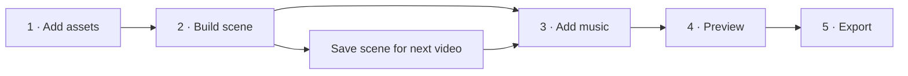

# Guided asset import and scene creation

Plan prepared on 4 October 2026; **not implemented**. Help Marco build scenes from his existing
Tabi images and animation files, then reuse a standard setup for music videos. Reduce the
parameters he must understand before seeing a useful result.

## User outcome and scope

The primary problem is the handoff from imported files to a usable scene. Marco explicitly
chose assembling existing artwork/animation, so this plan does not add AI artwork generation.
Deliver import and scene building first (T40–T44); then connect music, navigation and output
(T45–T47), and verify the whole journey (T48).

Marco's subsequent 90-second test clarified the normal train workflow: **one continuous cabin
and consistent Tabi pose, with small prepared movements and scenery scrolling independently**.
Switching between complete generated shots is not an acceptable substitute for this scene.
The one-off window-mask preparation authorized for that test does not add an automatic artwork
generation feature to this implementation plan.

The train recipe uses one fixed cabin, a prepared glass mask, an independently scrolling
exterior and complete transparent character frames above the exterior. The character clip owns
its face, arms and cup; an extra limb, blink or cup overlay must not duplicate what is already
painted. Entry/exit poses and prop contact must match. Review the entire moving composition,
including neck/collar continuity and ear outlines, rather than only checking opaque interiors.

Prefer long outside-watching holds and infrequent complete actions. The selected calm example
uses 78 seconds of window-facing idle and one 12-second coffee break. The source clips were
explicitly conformed from their measured 25 fps to this pack's 30 fps; importing frames must
not silently invent their timing. The one-off preparation does not implement the guided app.

The [creative review history](progress.md) retains the earlier breathing, timed-action, window
pose, anatomy and ear experiments. Separate body-part rigs and generated replacement ears were
rejected as the new direction. Additional actions and stronger breathing remain future work
following the baseline repair. The runtime consumes complete reviewed character frames; this
plan does not add a body-part editor or automatically reconstruct incompatible source clips.

**Current creative direction, 5 October:** Marco subsequently says the later variants are worse
and selects the [calm-window 90-second video](progress.md#t14--return-to-the-calm-window-baseline)
as the last good result. Its existing animations, poses, artwork and timing are the baseline.
Repair the local ear-edge flicker first, using the original source movement and ear shapes;
compare directly against that video. The generated replacement ears and parts rigs are
superseded experiments. Earlier extra-action/breathing requests remain future work, separate
from this limited repair.

## Can the normal app workflow produce this video?

**5 October assessment: the renderer can; the guided asset-to-video workflow is not complete.**
The calm baseline uses the real compiler, independent travel curve, full-character PNG
sequences and durable export jobs. Its cabin separation, cutouts, pose bridges and animation
pack were prepared with local scripts outside the UI. Importing a flattened scene or imperfect
cutouts does not reproduce that preparation. PNG proxies only normalize preview media; they
do not repair ears, reconnect anatomy or make incompatible actions consistent.

| Step | Current capability | Work needed for the intended workflow |
| --- | --- | --- |
| Prepare matching cabin, glass mask, exterior and complete character actions | External art/preparation, with manual visual review | Prepare one reusable train pack; retain source hashes and explicit preparation history. Do not promise automatic cleanup of arbitrary generated clips. |
| Import and bind the pack | Media import and authored template/action/episode JSON | T40–T44: grouped import, named scene recipes, visible missing inputs, compatible saved routines and reusable scene setup without hand-written JSON. |
| Set timing and continuous scenery | Python compiler, curves and editor already support it | T43–T45: expose safe routine/duration/travel defaults, fit only compatible complete actions, keep the exterior on one global clock. |
| Preview and export | Real preview, frozen snapshots and verified export jobs exist | T46–T48: one guided path and a fresh-project walkthrough using the reviewed train pack. |

The first product path is **Use saved scene → Calm train → choose scenery and duration →
preview the action → export**. Music can be added later. The initial saved routine keeps the
selected baseline: 1080p, 30 fps, 90 seconds, window-facing idle, one 12-second coffee break
at 36 seconds and 72 design-pixels/second travel. These are editable recipe defaults, not
facts to infer from filenames. Reuse complete character frames; do not layer new arms or a
separate breathing head on top of an already complete character.

Preparation happens once per reusable scene/action pack. When source artwork changes shape
between frames, use a small set of manually cleaned complete frames or a properly authored
animation export from the same character master. Temporal matte trimming can remove cutout
noise but cannot reconstruct damaged painted outlines. Integrating that experimental cleanup
into normal import is deferred until it passes moving before/after review. More scenarios use
compatible exterior strips; changing the outside does not regenerate Tabi.

The completion gate is a fresh project created entirely through the UI from a prepared train
pack, producing the 90-second scene, then a second video with a different compatible exterior
and duration. Neither run may require a preparation script, editing JSON or rebuilding Tabi.
One-time art preparation must be stated separately. T40 is still the first unblocked app task;
none of T40–T48 is implemented by this creative test.



Home offers **New video**, **Continue** and **Use saved scene**. Within a video, show the five
steps, the current project/video, saved state and one primary next action. Assets can be added
from the scene builder without losing the scene. Library and Settings are utility destinations.
Story, timeline, exact numeric controls, continuity, generation and diagnostics move under
Advanced; release preparation follows a verified export. Existing advanced workflows stay usable.

## What the repository explains about the confusion

| Current implementation | Required change |
| --- | --- |
| `web/src/main.ts` builds navigation from all 12 entries in `web/src/wireframes.ts` | Separate workflow steps from tools and historical playback-spike layouts |
| `web/src/assets.ts` exposes ID, version, media kind, fps numerator/denominator, provenance and JSON at import | Detect technical facts; ask for the asset's role and only unresolved information |
| That importer sends fps for both sequences and video; `probe_media()` accepts explicit fps only for sequences | Probe video timing and omit the override; cover this actual mismatch in T40/T41 |
| Still-template creation is inside the inspector; layered templates/packs require JSON import | Offer visible scene recipes and create the underlying documents in Python |
| `SceneTemplate` already has ordered slots, masks, anchors and capabilities | Build a bounded authoring interface over these contracts |
| The renderer requires scene-sized still/mask layers and compatible prepared character clips | Prepare explicit derived layers and explain incompatibilities before rendering |
| `NewEpisode` requires frame duration; `AudioEditor` rejects music longer than the scene | Add an explicit music-length proposal for generated standard scenes |
| Preferences cover export, encoder, theme and cache, but not the whole creation flow | Add reusable technical defaults; keep source facts and approvals separate |

## The proposed import experience

Drop/select files → see grouped thumbnails → choose what each group is for → **Import and use**.
Each card shows a friendly name, detected dimensions/type, animation length when known, and
one next action. A folder of consecutively numbered frames becomes one proposed animation,
not 97 independent assets. Unrelated stills remain separate assets.

Role choices: **Complete scene image**, **Background**, **Tabi animation**, **Foreground**,
**Window mask**, **Scenery strip**, **Music**, or **Reference only**. A role is the user's intent;
file type, dimensions and alpha are measured facts. Transparency alone cannot establish a role.
Ambiguous groups, missing sequence frames and unknown timing get specific explanations beside
the affected card. Advanced metadata stays collapsed. Pending rights never prevent a draft preview.

| Parameter | Proposed default / automatic behavior | When a choice is needed |
| --- | --- | --- |
| Asset name/ID/version | Name from filename; Python allocates a safe collision-resistant ID and initial `1.0` | Friendly name may be changed; replacing an existing asset creates a new version |
| Storage | Copy into the current project; preserve originals | Linking an external drive is Advanced |
| Media type and dimensions | Probe actual bytes; group a sequence by naming/order and matching media properties | Ambiguous file groups require confirmation; do not use extension alone |
| Video source fps | Read the actual source rate | Unsupported/variable-rate sources need explicit preparation, never an assumed 30 fps |
| PNG sequence source fps | Reuse a supplied manifest or the explicitly selected known export preset | Otherwise ask once in plain language; a PNG folder has no timing metadata |
| Alpha / mask meaning | Detect alpha; validate masks as raw grayscale, white visible | Do not infer a window mask from any grayscale image or remove a background automatically |
| Provenance / rights | Preserve supplied facts; unknown creator/history stays unknown, rights pending, approval draft | Human confirmation is needed for factual rights/approval; JSON is not required for ordinary import |
| Compatibility | Derive from the chosen recipe and checked assets when binding the scene | Never mark an unrelated camera/outfit/clip compatible just because its name says Tabi |

## Build the scene visibly

Offer three recipe cards with a thumbnail, a small asset checklist and an honest result description:

| Recipe | Inputs | Result |
| --- | --- | --- |
| **Complete image** | One finished scene still | A static scene ready for music; no invented animation |
| **Character over background** | Background without a baked-in duplicate character; prepared transparent character animation; matching foreground when its cutout needs occlusion | Tabi's reviewed prepared motion over the selected scene |
| **Layered train** | Prepared cabin/background, window mask, compatible exterior strips, character animation and foreground | A composed train scene with optional supported movement; missing layers listed individually |

The builder shows the rendered scene on the left and a short ordered layer list on the right.
Choose/replace assets by thumbnail, toggle supported layers and position the character through
an anchor control. Python validates placement and produces the updated still. Basic options
are **Keep image proportions** (default), **Fill frame** (explicit crop preview), **No motion**
or a reviewed animation loop. Scenery movement appears only for valid prepared strips with
declared periods; weather appears only for templates with the necessary artwork/masks.
No general rig editor, automatic cutout extraction or independent browser compositor is added.

The first actual-asset examples should use the existing source audit, not a fictional asset pack:

| Supplied source | Guided example and limit |
| --- | --- |
| `docs/assets/scenario/tabi-train-example.png` | “Use as complete scene”: 1664×936 flattened RGB image, fit to a 1080p output. It already contains Tabi; putting another Tabi on it would duplicate the character. |
| `docs/assets/tabi-assets/train-actions/breath/` | Group 97 RGBA frames at 1920×1080 into one character-animation candidate. Ask for the actual source rate and inspect its loop seam; do not claim 30 fps from the file count. Existing blinks mean no second blink overlay. |
| `docs/assets/tabi-assets/train-actions/drink/` | Group 129 frames as an action candidate. Drinking changes cup/pose state; do not loop it automatically or silently offer it as an idle loop. |
| Train/Tokyo panorama references | Explain missing cabin/window/foreground separation and unreviewed tile seams. Landmarks baked into a panorama cannot be treated as endlessly repeating neutral scenery. |

The [source audit](09-implementation-review.md) records a table-shaped missing region in the
character cutouts. The app must explain the need for matching foreground or repaired source
art instead of suggesting arbitrary placement will work. Draft composition previews may reveal
this problem; they are not artistic approval. The existing assets do not supply a finished
animated train pack simply by being imported.

## Standard video defaults

These are proposed starting values, editable under Advanced. They do not change an existing
episode automatically. A saved scene retains exact versions and its reviewed timing.

| Function | Starting behavior |
| --- | --- |
| Video format | One-scene `session`, 16:9, 1920×1080; one saved scene reused across the music |
| Frame rate | 30/1 for still scenes; use the selected compatible animation pack's actual supported rate for animated scenes. Show a source-driven exception such as 25 fps in the summary; never reinterpret 25 fps as 30. |
| Scene canvas | Preserve source design geometry; fit the complete composition into the output. Derived layer preparation uses one explicit transform for aligned background/mask/foreground groups. |
| Duration | Full length of the selected ordered music; no song stretching, trimming, repeats or fixed 30–60-minute target |
| Before music | A clearly labeled 10-second silent scene check; “Add music to set video length” |
| Character | No motion until a compatible prepared loop or saved routine is chosen. The calm train routine includes its declared coffee action and matching poses; arbitrary imported clips never gain automatic sip/read transitions. |
| Train scenery | One continuous travel phase across character blinks, action repeats and render chunks. Validate available strip coverage for the chosen duration; a short non-wrapping pass does not establish a seamless long-form loop. |
| Weather / lighting / ambience | Off unless already authored in the selected saved scene; no invented rain or train noise |
| Audio | Complete masters in order, 0 dB gain, no added fades/crossfades or loudness remastering; 48 kHz prepared mix, original masters unchanged |
| Quick preview | 960×540, first ten seconds or shorter if the episode is shorter; optional loop-seam/other-range review |
| Export | Existing 1080p SDR H.264/AAC profile: 8 Mb/s at up to 30 fps, stereo 48 kHz AAC at 384 kb/s; use existing higher-fps profile rules |
| Encoder / queue | Existing saved encoder, otherwise `libx264`; one active export, existing 900-frame chunk cap hidden in Advanced |
| Output location | A unique file under the project's `exports/`, with the actual location shown before starting |
| Future videos | “Use saved scene” and “Save as my defaults”; default changes affect future drafts only |

Reuse a preset's technical settings. Never reuse a guessed source rate for unrelated files,
promote pending rights, copy snapshot approval to a new video, or silently update approved assets.

## Implementation conventions

All tasks below are **planned**. Follow the [active index](tasks/INDEX.md). Domain operations
belong in Python; API and CLI call the same service. Retain strict unknown-field/version checks,
integer frames/samples, immutable versions and revision guards. New optional preference fields
must preserve loading and content hashes of legacy documents; use explicit backed-up migrations
if that is impossible. No database or parallel implementation lane is needed.

For each contract change, register the exact output models in `src/tabi/core/models/__init__.py`
or `src/tabi/api/contracts.py` as appropriate. Regenerate the named schema/type files and the
shared `web/src/generated/documents.ts`, `web/src/generated/validators.cjs` and
`web/src/generated/validators.d.cts` using `make schemas` and `make web-build`; do not hand-edit
generated validators. Each implementation task also updates `docs/progress.md` and
`docs/tasks/INDEX.md` with its verification and commit. New file paths are marked below.

<a id="t40"></a>

## T40 — Derive safe import choices in Python

**Target files**
- `src/tabi/core/assets/import_plan.py` (new) — typed inspection/grouping proposal and import resolution.
- `src/tabi/core/assets/probe.py`, `src/tabi/core/assets/service.py` — reuse actual probing and immutable import; preserve detected source timing.
- `src/tabi/api/uploads.py`, `src/tabi/api/workspace.py`, `src/tabi/api/contracts.py` — authenticated proposal/commit adapters and `WebImportPlan` contract.
- `src/tabi/cli/assets.py` — shared import-plan adapter.
- `schemas/web_import_plan.schema.json`, `web/src/generated/web_import_plan.ts` (new) — published inspection response.
- `tests/unit/test_import_plan.py` (new), `tests/unit/test_web_workspace.py`, `tests/integration/test_asset_import.py` — grouping, ambiguity, timing and actual media regression.

**Inputs / dependencies**
- None in this backlog. Existing `ImportRequest`, `probe_media`, `AssetService`, bounded upload receipts and source audit.

**Implementation rules**
- Inspect staged/registered files in Python; propose natural numeric sequence order, groups, measured facts, unresolved choices and safe IDs. Equal names alone never identify equal content.
- Separate unrelated stills; report gaps/duplicate frame numbers, inconsistent canvases and corrupt input on their group. Do not guess sequence fps or classify a pose collection as animation without confirmation.
- Send no fps override for video; retain probed rational timing. Revalidate facts/hashes on commit and refuse unsupported timing rather than reinterpreting it.
- Copy by default; retries are safe through existing receipts and immutable identities. Per-group success persists if another group fails. Reuse identical existing assets only when content and relevant kind/timing/metadata match.
- Provenance/rights remain factual and draft. Protect registered roots, CSRF and source bytes through both adapters.

**Verification command**
```sh
make schemas
.venv/bin/python -m pytest tests/unit/test_import_plan.py tests/unit/test_web_workspace.py
.venv/bin/python -m pytest --run-media tests/integration/test_asset_import.py
make web-build
```

<a id="t41"></a>

## T41 — Guide import with defaults and examples

**Target files**
- `web/src/assets.ts`, `web/src/workspace.ts`, `web/src/style.css` — grouped cards, unresolved choices, contextual import and return to the scene.
- `web/src/import-state.ts` (new), `web/tests/import-state.test.mjs` (new) — selection/retry/return state independent of DOM.
- `docs/26-project-workflows.md` — document the implemented import behavior.

**Inputs / dependencies**
- T40's proposal/commit API and the import defaults table above.

**Implementation rules**
- The normal form asks for files, a friendly name and intended role. Show read-only detected facts; hide IDs, versions, raw provenance JSON and numerator/denominator controls under Advanced.
- Ask only unresolved questions beside the relevant card, including source fps for unmanifested PNG sequences. A proposed/default value must never look like detected evidence.
- Provide worked cards for a complete image, numbered animation and WAV. Display pending review unobtrusively while allowing draft use.
- Preserve bounded uploads, cancellation, resumable byte checks and per-group outcomes. Retrying after navigation must not duplicate an imported asset.
- “Import and use in scene” carries selected asset references and returns to the originating slot; Library import offers “Build a scene”.

**Verification command**
```sh
make web-check
make web-build
```
Also exercise file picker and drag/drop with spaces/Unicode, separate stills, a numbered sequence
and one failed group in Safari and Chrome; record screenshots and one resume-after-refresh case.

<a id="t42"></a>

## T42 — Build still and layered scene drafts from assets

**Target files**
- `src/tabi/core/models/scenes.py`, `src/tabi/core/models/__init__.py`, `src/tabi/core/persistence.py` — strict `SceneSetup` document and `scene-setups/<id>.json` storage mapping.
- `src/tabi/core/scene_builder.py` (new) — typed recipes, compatibility report, draft template creation and versioned reuse.
- `src/tabi/core/assets/prepare.py` (new) — explicit derived full-canvas still/mask preparation with source/transform hashes.
- `src/tabi/core/authoring.py` — use the shared builder and existing still-template path.
- `src/tabi/api/workspace.py`, `src/tabi/api/contracts.py`, `src/tabi/cli/authoring.py` — scene proposal/apply adapters and `WebScenePlan` response.
- `src/tabi/core/portability.py`, `tests/unit/test_portability.py` — include saved scene setups and referenced sources in backup/restore.
- `schemas/scene_setup.schema.json`, `web/src/generated/scene_setup.ts`, `schemas/web_scene_plan.schema.json`, `web/src/generated/web_scene_plan.ts` (new) — generated setup and plan contracts.
- `schemas/web_catalog.schema.json`, `web/src/generated/web_catalog.ts` — publish saved setups in the project catalog.
- `tests/unit/test_scene_builder.py`, `tests/integration/test_scene_builder.py` (new) — recipe validation, source preservation and rendered layer evidence.

**Inputs / dependencies**
- T40; `SceneTemplate`, `LayerSlot`, `AssetRef`, current renderer canvas/mask restrictions and reference geometry.

**Implementation rules**
- Define `SceneSetup` before the builder: a revisioned project-local draft with a friendly title, recipe kind, exact template reference, optional exact action-pack reference, rational fps and initial pose. Referenced templates hold slots/anchors; packs hold animation facts. This small JSON document is the reusable setup, not another approval record or a database. Older projects simply have no setups.
- Offer Complete image and the static layer portions of Character over background / Layered train. Build valid ordered slots, camera IDs and declared anchors in Python; no hand-written JSON in the basic path.
- A complete image preserves its design canvas and fits as a whole. Layered recipes require a consistent design canvas; propose derived fit/crop copies instead of altering originals. Preserve alpha and raw mask values; apply the same geometric transform to explicitly aligned groups.
- For missing/incompatible art, return the affected role and a concrete next action. Do not remove baked-in Tabi, repair hidden regions, generate missing layers or assume a panorama is tileable.
- Scenery strips require their actual period/coverage and review; unsupported effects stay unavailable. Keep these rules recipe-driven, not train-specific branches in the compiler.
- A continuous-train recipe keeps one cabin/camera and advances the existing global travel curve independently of character source time. Never replace this recipe with cuts between full-scene action clips. A flattened idle clip may be used only with a prepared, checked window-replacement mask and compatible scene geometry.
- Save metadata only after dependencies exist; use guarded new versions and retry-safe identities. On failure leave the last usable scene intact; harmless unreferenced new drafts are discoverable for retry, not claimed as a completed scene.
- Reusing a saved setup creates a fresh episode through Python with new identity and draft state. Preserve exact asset versions, clear episode-level reviews/music, and let the music step set its duration. Backup/restore preserves the setup and all referenced sources.

**Verification command**
```sh
make schemas
.venv/bin/python -m pytest tests/unit/test_scene_builder.py tests/unit/test_metadata_review.py tests/unit/test_portability.py
.venv/bin/python -m pytest --run-media tests/integration/test_scene_builder.py
make web-build
```

<a id="t43"></a>

## T43 — Bind prepared animation to the scene

**Target files**
- `src/tabi/core/scene_builder.py`, `src/tabi/core/models/scenes.py` — produce compatible draft `ActionPack`, body coverage, saved routine references and scene/episode binding.
- `src/tabi/core/authoring.py`, `src/tabi/api/workspace.py`, `src/tabi/api/contracts.py`, `src/tabi/cli/authoring.py` — shared animation-binding proposal/apply.
- `schemas/scene_setup.schema.json`, `web/src/generated/scene_setup.ts`, `schemas/web_scene_plan.schema.json`, `web/src/generated/web_scene_plan.ts` — include saved routine references, animation requirements and preview intervals.
- `tests/unit/test_scene_builder.py`, `tests/integration/test_scene_builder.py` — real alpha, loop phase, channel and compatibility checks.

**Inputs / dependencies**
- T42; actual clip fps, canvas, alpha, anchor, pose and loop interval, either supplied by a prepared pack or explicitly entered/reviewed. Human source facts are needed for real-art completion; synthetic prepared clips unblock engineering.

**Implementation rules**
- Reuse compatible existing packs first. For a prepared transparent sequence, offer a simple looping-idle binding with source range, anchor and declared start/end pose; create the pack and compatibility metadata as new drafts.
- Do not loop an arbitrary clip on import. Provide a two-cycle seam preview and explicit loop selection. A drinking/prop-changing one-shot needs reviewed entry/exit/prop declarations. Expose it normally only through an already compatible saved routine; authoring arbitrary one-shots stays Advanced.
- Bind a saved scene to a reusable routine of reviewed complete actions. The first train routine preserves the calm baseline's 78 seconds of window idle and one 12-second coffee break at 36 seconds. Offer idle-only and calm pacing through Python-authored schedules, fit complete actions inside the requested duration and finish in the declared resting pose. Do not infer transitions or overlay a second body/face/breathing channel. Reusing an existing pack must not require hand-written episode JSON.
- Review the complete composition across an animation repeat with travel enabled: character pose remains aligned and exterior motion does not reset. An isolated character thumbnail cannot establish scene continuity.
- Default a composite character clip to owning body and face so an extra blink cannot double it. Preserve reviewed pack channel rules when reusing one.
- Prefer reviewed complete character frames for this train recipe. Do not add moving arms over a body that still contains resting arms, or a replacement cup over a clip that owns its cup. Review neck/collar continuity, arm replacement, table contact and matching full poses in the actual composed action. Alpha coverage and successful rendering do not approve anatomy.
- Check ear outlines and roots through the complete moving action with exterior travel enabled. Opaque interior coverage does not detect changing silhouettes, cutout chatter or retained source fragments. Reuse consistent artwork across poses and review temporal edges before a full render; preserve the face, collar and prop while repairing ear cutouts.
- Scene timing follows the selected pack's supported actual rate; mixed-rate packs need explicit preparation. No automatic resampling or duration change disguised as a default.
- Use the existing compiler for coverage, channel, pose, camera, outfit and anchor checks. Position through supported anchors; arbitrary character scaling/rigging is out of scope.
- Source media, pack and episode approvals remain separate. A technical seam test cannot grant human approval.

**Verification command**
```sh
make schemas
.venv/bin/python -m pytest tests/unit/test_scene_builder.py tests/unit/test_compiler.py tests/unit/test_metadata_review.py
.venv/bin/python -m pytest --run-media tests/integration/test_scene_builder.py tests/integration/test_activity_render.py
make web-build
```

<a id="t44"></a>

## T44 — Make scene building visual and reusable

**Target files**
- `web/src/scene-builder.ts` (new) — recipe cards, role slots, renderer still, animation review and save/reuse scene.
- `web/src/scene-state.ts`, `web/tests/scene-state.test.mjs` (new) — pending changes, guarded application and contextual import return.
- `web/src/assets.ts`, `web/src/workspace.ts`, `web/src/main.ts`, `web/src/style.css` — reachable builder, library selection and current draft context.
- `docs/26-project-workflows.md` — actual scene workflow and supplied-asset examples.

**Inputs / dependencies**
- T41, T42 and T43; the three recipe cards and actual-asset examples above.

**Implementation rules**
- Show a real renderer-produced still beside ordered role cards and a missing-input checklist. Expose only relevant roles, with “Choose”, “Import” and “Replace”; keep the current composition visible while edits validate.
- A character placement gesture submits an anchor change to Python; it is not a second browser compositor. Debounce still requests, discard outdated responses and cancel only owned superseded preview work.
- Render a short scene check before music. Show unknown fps, missing foreground and baked-in-character guidance in context. No fake sample preview may be presented as the user's scene.
- “Save scene” stores a usable template/pack combination. “Use saved scene” creates a new draft using exact versions; approved originals remain immutable. Save/reload must retain role choices and the current scene.
- Show the saved scene's available routines, compatible exterior choices, duration and supported travel speed with the calm defaults above. Preview the coffee entry, sip, return and idle repeat over moving scenery before accepting a new pack version. Show baseline and candidate together; technical validation never labels a repair visually fixed.
- Keep unsupported scaling, arbitrary one-shot authoring and manual metadata in Advanced. Keyboard controls, focus return and error links must reach each affected slot.

**Verification command**
```sh
make web-check
make web-build
```
Record Safari/Chrome walkthroughs for a supplied-image static draft and a clearly synthetic
animated layered scene, including missing-mask correction, loop review, save/reopen and reuse.
Real train-art quality remains a separate gate if matching layers/timing are unavailable.

<a id="t45"></a>

## T45 — Apply standard defaults and let music set the length

**Target files**
- `src/tabi/core/models/settings.py`, `src/tabi/core/preferences.py` — optional version-compatible creation defaults.
- `src/tabi/core/authoring.py`, `src/tabi/core/audio/editor.py`, `src/tabi/core/audio/timeline.py` — shared proposal to fit an eligible one-scene draft to ordered full tracks.
- `src/tabi/api/workspace.py`, `src/tabi/api/audio.py`, `src/tabi/api/contracts.py`, `src/tabi/cli/authoring.py`, `src/tabi/cli/audio.py` — parity for standard creation and explicit duration application.
- `src/tabi/core/models/audio.py` — extend the audio proposal with optional duration effects where needed.
- `schemas/app_preferences.schema.json`, `schemas/web_settings.schema.json`, `schemas/audio_edit_plan.schema.json`, `schemas/web_audio.schema.json` — regenerate affected contracts.
- `web/src/generated/app_preferences.ts`, `web/src/generated/web_settings.ts`, `web/src/generated/audio_edit_plan.ts`, `web/src/generated/web_audio.ts` — generated types.
- `web/src/workspace.ts`, `web/src/audio.ts`, `web/src/production.ts` — standard setup, track list and “Save as my defaults”.
- `tests/unit/test_preferences.py`, `tests/unit/test_audio_editor.py`, `tests/unit/test_authoring_cli.py`, `tests/integration/test_web_audio.py` — compatibility, duration and real audio verification.

**Inputs / dependencies**
- T42 and T43; the standard defaults table; existing rational frame/sample conversion and guarded audio edits.

**Implementation rules**
- The normal music step is import/select WAVs, order tracks and view total duration. Defaults preserve whole masters, gain and source facts; technical sample fields remain Advanced.
- Calculate the smallest whole-frame duration whose existing `sample_at()` boundary covers all prepared music samples using exact rational arithmetic. Pad only the sub-frame remainder with silence; never truncate a master or label a rounding remainder as a missing song.
- Propose/apply the track placement, single-scene end and validated repeating-body coverage as one guarded episode edit. Only mechanically generated standard scenes qualify; manual actions/curves/beats/transitions or multiple scenes produce a specific conflict requiring an explicit edit.
- Retain the old audio API's explicit-duration behavior for existing/custom projects. Scene checks before music are labeled silent; removing music does not silently shrink an authored video.
- Defaults precedence: explicit draft values, explicitly saved personal technical defaults, built-in values; animation compatibility overrides an incompatible proposed fps with a visible explanation. Existing episodes are never retroactively changed.
- Saved scene references belong to their project; don't put another project's asset IDs in global defaults. Persist the seed once per draft. Remembering defaults never remembers guessed rights or source timing.

**Verification command**
```sh
make schemas
.venv/bin/python -m pytest tests/unit/test_preferences.py tests/unit/test_audio_editor.py tests/unit/test_authoring_cli.py
.venv/bin/python -m pytest --run-media tests/integration/test_web_audio.py
make web-check
make web-build
```

<a id="t46"></a>

## T46 — Connect the five steps with real readiness and context

**Target files**
- `src/tabi/core/workflow.py` (new) — derive the next useful action from actual assets, scene, episode, previews and jobs.
- `src/tabi/api/workflow.py` (new), `src/tabi/api/app.py`, `src/tabi/api/contracts.py` — read-only workflow status under existing security.
- `schemas/web_workflow.schema.json`, `web/src/generated/web_workflow.ts` (new) — status, blockers and action destinations.
- `web/src/main.ts`, `web/src/workspace.ts`, `web/src/wireframes.ts`, `web/src/style.css` — Home, stepper, utilities and compatibility with old routes.
- `web/src/workflow-state.ts`, `web/tests/workflow-state.test.mjs` (new) — project/episode context and navigation state.
- `tests/unit/test_workflow.py`, `tests/unit/test_web_workflow.py` (new) — factual status, project isolation, stale inputs and authorization.

**Inputs / dependencies**
- T41, T44 and T45; existing project recents, catalog, preview stale detection and durable jobs.

**Implementation rules**
- Expose Add assets → Build scene → Add music → Preview → Export. Saved-scene reuse skips satisfied preparation work; visiting a page does not mark a step complete.
- Use current revisions/content identities to report scene readiness, missing music, stale preview, render progress and release blockers. Draft-preview readiness is distinct from production/publishing readiness.
- Persist content through existing project documents; selection is UI state, scoped by project and episode. Restore context on refresh/relaunch and don't show another project's selected episode.
- Every blocker has a plain-language explanation and a link to its specific correction. Enable visual checks without music and draft export without production approval, with their real labels.
- Move standalone inspector, timeline, notebook and technical tools out of primary navigation. Preserve old links through an Advanced route and keep playback-spike mode visibly separate.
- One primary next action; Back and direct step selection retain saved work. Guard pending structured edits; no full-screen wall of technical state.

**Verification command**
```sh
make schemas
.venv/bin/python -m pytest tests/unit/test_workflow.py tests/unit/test_web_workflow.py tests/unit/test_web_service.py
make web-check
make web-build
```

<a id="t47"></a>

## T47 — Preview and export without manual pipeline setup

**Target files**
- `src/tabi/core/workflow.py`, `src/tabi/core/episodes.py`, `src/tabi/core/jobs/service.py` — shared guarded preview/export preparation and retry-safe submission.
- `src/tabi/api/workflow.py`, `src/tabi/api/contracts.py`, `src/tabi/cli/episodes.py`, `src/tabi/cli/jobs.py` — adapters using existing services, not duplicated render semantics.
- `schemas/web_workflow.schema.json`, `web/src/generated/web_workflow.ts` — resolved output plan and retry identity if required.
- `web/src/preview.ts`, `web/src/production.ts`, `web/src/release.ts` — normal preview/export summary, progress and post-export actions.
- `tests/unit/test_workflow.py`, `tests/unit/test_web_workflow.py`, `tests/unit/test_web_production.py`, `tests/integration/test_web_preview.py`, `tests/integration/test_web_worker.py` — actual stale/double-submit/recovery checks.

**Inputs / dependencies**
- T45 and T46; existing compilation, snapshot review, preview selection, storage estimate, queue and verification services.

**Implementation rules**
- “Preview scene” selects the default range/profile in Python and queues the real proxy; show stale status and regenerate after changes. Exact-frame/longer-range tools are secondary.
- “Export video” shows resolution, complete duration, destination, storage and draft/production status. Resolve snapshots, chunking and profile internally; do not ask the user to copy a hash between forms.
- Production still requires actual input approval and a separate explicit content review, expressed as a readable review panel. Edits invalidate it; preview playback is never automatic approval.
- Revalidate the saved revision, hashes and storage at submission. Use a durable request identity bound to the resolved input so double clicks, ambiguous HTTP replies or reconnects cannot create duplicate jobs.
- Keep cancel/pause/resume and a readable failure remedy with expandable logs. Exports publish atomically after verification, never overwrite a prior file, and survive tab closure.
- The finished screen offers playback, the real file location, “Use this scene again” and optional release preparation; no publishing or invented metadata.

**Verification command**
```sh
make schemas
.venv/bin/python -m pytest tests/unit/test_workflow.py tests/unit/test_web_workflow.py tests/unit/test_web_production.py
.venv/bin/python -m pytest --run-media tests/integration/test_web_preview.py tests/integration/test_web_worker.py
make web-check
make web-build
```

<a id="t48"></a>

## T48 — Verify the complete guided workflow and update operations

**Target files**
- `tests/integration/test_guided_workflow.py` (new) — end-to-end import → composition → music → actual preview/export through the API.
- `web/tests/workflow-state.test.mjs`, `web/tests/scene-state.test.mjs`, `web/tests/import-state.test.mjs` — only substantive navigation/state regressions found by the journey.
- `docs/37-operations.md`, `docs/05-webapp.md`, `docs/26-project-workflows.md`, `docs/29-audio-editor.md`, `docs/30-render-queue.md`, `README.md` — replace instructions only after new controls work.
- `docs/evidence/t48-guided-workflow.json`, `docs/evidence/t48-import.png`, `docs/evidence/t48-scene.png`, `docs/evidence/t48-export.png` (new) — results and representative screenshots, no MP4.
- `docs/progress.md`, `docs/tasks/INDEX.md` — actual milestone results and limits.

**Inputs / dependencies**
- T40, T41, T42, T43, T44, T45, T46 and T47. Safari/Chrome on the target Mac; small labeled synthetic fixtures plus unchanged supplied stills. Original music/real-art approval remains independent.

**Implementation rules**
- Fresh project: import one scene image and WAV, reach a verified export through the guided steps with no JSON, asset IDs, frame arithmetic, encoder or chunk questions.
- Prepared animation: import a numbered transparent sequence, resolve its real fps/loop once, place it over a compatible background/foreground, inspect a true seam preview, save and reuse the scene. Verify one character and correct occlusion/phase across chunk boundaries.
- Missing-input journey: the supplied train still works as static; the actual breath/drink collection gets accurate timing/layer/action guidance. Never report the incomplete real pack as approved or ready for animation automatically.
- Reuse: create a second video from the saved scene by changing title/music only; show the new duration. Reopen after a worker restart; preserve media, versions and deliberate overrides.
- Train acceptance: start from a fresh project and a prepared train pack, select its calm routine, render the 90-second continuous ride, then reuse the scene with another compatible exterior and duration. No preparation script, metadata JSON editing or character reconstruction is allowed during either normal production run. Record one-time external art preparation separately and review moving ears, neck/collar, exactly two arms, cup contact, full action endpoints and exterior continuity. Test longer durations only with reviewed panorama coverage/wraps; this 90-second pass is not evidence of a seamless long-form journey.
- Exercise incompatible fps, missing mask, failed/resumed import, stale second-tab edits, ambiguous export replies, cancel/restart/resume, pending rights and insufficient space. Check that source hashes and old snapshots remain unchanged.
- Observe 1280×800 and narrow laptop layouts, keyboard/focus operation, authenticated playback and scale-readable labels in Safari/Chrome. Marco can follow the steps without developer guidance; usability acceptance remains pending until he tries it.
- Record checks, versions, screenshots and local clip paths. Do not rerun the 45-minute/4K benchmark unless implementation changes invalidate its assumptions; run the existing full media gate for regression coverage.

**Verification command**
```sh
make check
make web-check
make web-build
TABI_CONFIG=examples/settings.macos.toml make test-media
make package
```
Also run the installed build outside the checkout with Node absent from the runtime path and
record the browser journeys above. Use the Mac config only if those exact tool paths exist.
